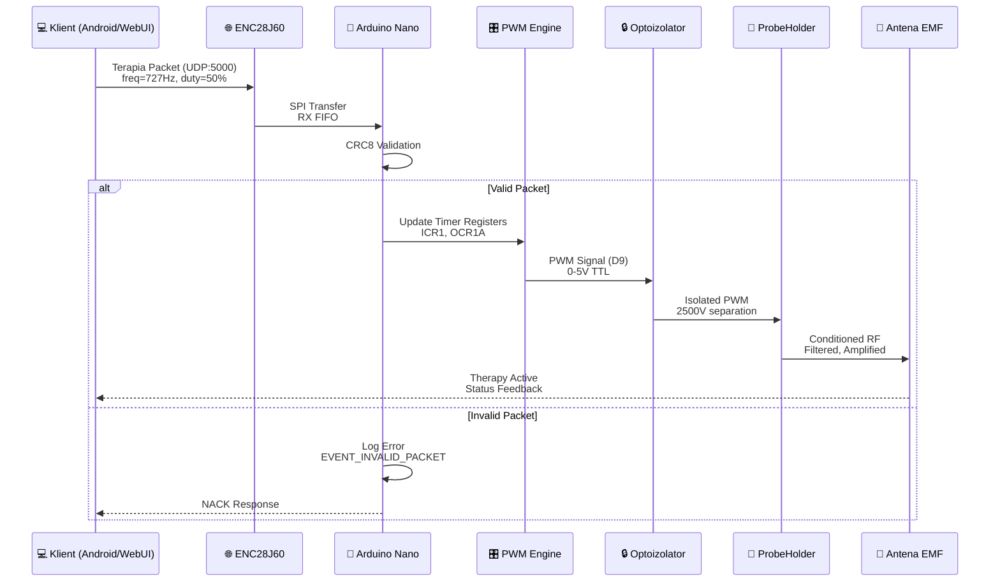
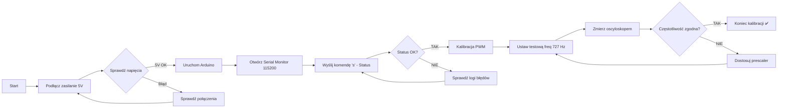

# 📘 Wzorzec Dokumentacji Technicznej - ResoNet-Nano Template

<div align="center">


**Szablon dokumentacji technicznej z diagramami blokowymi Mermaid.js**

[Struktura](#-struktura-dokumentu) • [Diagramy](#-diagramy-blokowe) • [Tabele](#-tabele-i-specyfikacje) • [Kod](#-przykłady-kodu)

</div>

---

## 📋 Spis Treści

- [Struktura Dokumentu](#-struktura-dokumentu)
- [Diagramy Blokowe](#-diagramy-blokowe)
  - [Schemat Ideowy Systemu](#schemat-ideowy-systemu)
  - [Schemat Elektryczny Połączeń](#schemat-elektryczny-połączeń)
  - [Przepływ Danych](#przepływ-danych)
- [Tabele i Specyfikacje](#-tabele-i-specyfikacje)
- [Przykłady Kodu](#-przykłady-kodu)
- [Instrukcje Krok po Kroku](#-instrukcje-krok-po-kroku)

---

## 📁 Struktura Dokumentu

### ✅ Elementy Standardowe

Każdy plik `.md` powinien zawierać:

1. **Nagłówek z badge'ami** - wersja, status, kluczowe informacje
2. **Spis treści** - automatycznie generowany przez GitHub/GitLab
3. **Sekcje z emoji** - dla lepszej nawigacji wizualnej
4. **Diagramy Mermaid** - zamiast ASCII art
5. **Tabele porównawcze** - dane techniczne w formie tabel
6. **Bloki kodu z syntax highlighting** - przykłady implementacji
7. **Ostrzeżenia i uwagi** - wyróżnione bloki alertów

---

## 🎨 Diagramy Blokowe

### Schemat Ideowy Systemu

```mermaid
blockDiagram
    title "ResoNet-Nano - Architektura Systemu"
    
    block:Zasilanie["💡 ZASILACZ MEDYCZNY\n5V/2A, IEC 60601-1"]
        style fill:#e3f2fd,stroke:#1976d2,stroke-width:2px
    end
    
    block:Arduino["🧠 ARDUINO NANO\nATmega328P, 16MHz"]
        style fill:#fff3e0,stroke:#f57c00,stroke-width:2px
    end
    
    block:Ethernet["🌐 MODUŁ ETHERNET\nENC28J60, SPI, 10Mbps"]
        style fill:#e8f5e9,stroke:#388e3c,stroke-width:2px
    end
    
    block:Izolacja["🔒 IZOLACJA GALWANICZNA\n2500V RMS, Optoizolatory"]
        style fill:#fce4ec,stroke:#c2185b,stroke-width:2px
    end
    
    block:ProbeHolder["🔬 PROBEHOLDER\nFiltr LC, MOSFET, BNC"]
        style fill:#f3e5f5,stroke:#7b1fa2,stroke-width:2px
    end
    
    block:Antena["📡 ANTENA EMF\nCewka płaska/ferrytowa"]
        style fill:#fff8e1,stroke:#fbc02d,stroke-width:2px
    end
    
    Zasilanie --> Arduino : "5V DC\n(zasilanie)"
    Arduino --> Ethernet : "SPI\n(D10-D13)"
    Arduino --> Izolacja : "PWM\n(D9, opto)"
    Izolacja --> ProbeHolder : "PWM_BUF\n(izolowane)"
    ProbeHolder --> Antena : "RF Output\n(BNC)"
    
    classDef default text-align:left,font-family:monospace;
```

### Schemat Elektryczny Połączeń

```mermaid
flowchart TD
    subgraph Zasilanie["⚡ SYSTEM ZASILANIA"]
        Z1[\"<b>ZASILACZ SIECIOWY</b><br/>230V AC → 5V DC<br/>IEC 60601-1 Medical\"]
        Z2[\"<b>FILTR LC</b><br/>10µH + 100µF<br/>Filtracja zakłóceń\"]
        Z3[\"<b>IZOLATOR DC-DC</b><br/>2500V RMS<br/>B0505S-1W\"]
    end
    
    subgraph Sterowanie["🎛️ SYSTEM STEROWANIA"]
        A1[\"<b>ARDUINO NANO</b><br/>ATmega328P<br/>Pin D9: PWM<br/>Pin D10-13: SPI\"]
        A2[\"<b>ENC28J60</b><br/>Ethernet Module<br/>3.3V LDO<br/>SPI Interface\"]
    end
    
    subgraph Wyjście["🔌 SYSTEM WYJŚCIOWY"]
        O1[\"<b>OPTOIZOLATOR</b><br/>6N137/HCPL-2630<br/>10 MHz bandwidth\"]
        O2[\"<b>MOSFET DRIVER</b><br/>IRF540N<br/>100V, 33A\"]
        O3[\"<b>FILTR DOLNOPRZEPUSTOWY</b><br/>LC: 100µH + 100nF<br/>Butterworth 2nd order\"]
        O4[\"<b>ZŁĄCZE BNC</b><br/>50Ω impedance<br/>RF output\"]
    end
    
    subgraph Efektor["📶 EFEKTOR"]
        E1[\"<b>ANTENA EMF</b><br/>Flat Coil / Ferrite<br/>50-200µH<br/>1-100µT @ 1cm\"]
    end
    
    Z1 --> Z2 --> Z3
    Z3 --> A1
    A1 <-->|SPI<br/>D10-CS<br/>D11-MOSI<br/>D12-MISO<br/>D13-SCK| A2
    A1 -->|PWM<br/>D9| O1
    O1 --> O2 --> O3 --> O4
    O4 --> E1
    
    style Z1 fill:#bbdefb,stroke:#1976d2,stroke-width:2px
    style Z2 fill:#bbdefb,stroke:#1976d2,stroke-width:2px
    style Z3 fill:#ffcdd2,stroke:#c62828,stroke-width:3px
    style A1 fill:#ffe0b2,stroke:#f57c00,stroke-width:2px
    style A2 fill:#c8e6c9,stroke:#388e3c,stroke-width:2px
    style O1 fill:#ffcdd2,stroke:#c62828,stroke-width:3px
    style O2 fill:#fff9c4,stroke:#f9a825,stroke-width:2px
    style O3 fill:#e1bee7,stroke:#7b1fa2,stroke-width:2px
    style O4 fill:#b2dfdb,stroke:#00897b,stroke-width:2px
    style E1 fill:#fff3e0,stroke:#ef6c00,stroke-width:2px
```

### Przepływ Danych



### Diagram Stanów Systemu

```mermaid
stateDiagram-v2
    [*] --> INIT : Power On
    INIT --> SAFETY_CHECK : Initialize Hardware
    
    state SAFETY_CHECK {
        [*] --> TEMP_OK : Temp < 70°C
        TEMP_OK --> VOLTAGE_OK : Voltage Stable
        VOLTAGE_OK --> [*]
        
        TEMP_OK --> TEMP_WARN : Temp > 70°C
        TEMP_WARN --> TEMP_CRITICAL : Temp > 85°C
        TEMP_CRITICAL --> SHUTDOWN
    end
    
    SAFETY_CHECK --> STANDBY : All Checks Pass
    SAFETY_CHECK --> SHUTDOWN : Check Failed
    
    STANDBY --> THERAPY_ACTIVE : Start Command
    THERAPY_ACTIVE --> STANDBY : Therapy Complete
    THERAPY_ACTIVE --> EMERGENCY_STOP : E-Stop Pressed
    
    state THERAPY_ACTIVE {
        [*] --> PWM_GENERATION
        PWM_GENERATION --> MODULATION_AM : AM Mode
        PWM_GENERATION --> MODULATION_FM : FM Mode
        PWM_GENERATION --> MODULATION_BURST : Burst Mode
        MODULATION_AM --> [*]
        MODULATION_FM --> [*]
        MODULATION_BURST --> [*]
    }
    
    EMERGENCY_STOP --> SHUTDOWN :Latch Activated
    SHUTDOWN --> [*] : Manual Reset Required
    
    note right of SHUTDOWN
        Requires physical
        reset after fault
    end note
```

---

## 📊 Tabele i Specyfikacje

### Tabela Połączeń Głównych

| Źródło | Pin | Cel | Typ Sygnału | Izolacja | Uwagi |
|:------:|:---:|-----|:-----------:|:--------:|-------|
| **Arduino Nano** | D10 (SS) | ENC28J60 CS | SPI Chip Select | ❌ Brak | Pull-up 10kΩ |
| **Arduino Nano** | D11 (MOSI) | ENC28J60 SI | SPI Data Out | ❌ Brak | - |
| **Arduino Nano** | D12 (MISO) | ENC28J60 SO | SPI Data In | ❌ Brak | - |
| **Arduino Nano** | D13 (SCK) | ENC28J60 SCK | SPI Clock | ❌ Brak | Mode 0 |
| **Arduino Nano** | D9 (PWM) | ProbeHolder | PWM 16-bit | ✅ Opto 6N137 | Timer1 OC1A |
| **Arduino Nano** | D5 (PWM) | IR LED Strip | IR Carrier 38kHz | ✅ Opto | - |
| **Izolator DC** | 5V_ISO | ProbeHolder VCC | Power 5V | ✅ 2500V RMS | B0505S-1W |
| **Izolator DC** | GND_ISO | ProbeHolder AGND | Analog GND | ✅ 2500V RMS | Separate from DGND |

### Porównanie Typów Modulacji

| Typ | Opis | Zakres Częstotliwości | Zastosowanie | Przykład |
|:---:|------|:---------------------:|--------------|----------|
| **AM** | Modulacja amplitudy (sinus) | 1-100 Hz | Terapia powierzchniowa | 727 Hz @ 10 Hz AM |
| **FM** | Modulacja częstotliwości (±10%) | 0.5-50 Hz | Głęboka penetracja | 727 Hz ±72.7 Hz @ 0.5 Hz |
| **BURST** | Cykle on/off | 0.1-10 Hz | Stymulacja pulsacyjna | 500ms ON / 500ms OFF |
| **PWM** | Regulacja wypełnienia | DC-500 kHz | Sterowanie mocą | Duty cycle 1-99% |
| **SWEEP** | Przemiatający zakres | Variable | Skanowanie rezonansu | 100-1000 Hz sweep |

### Specyfikacja Komponentów

| Komponent | Model | Parametry Kluczowe | Producent | Status |
|-----------|-------|-------------------|-----------|--------|
| **Mikrokontroler** | ATmega328P | 16MHz, 32KB Flash, 2KB SRAM | Microchip | ✅ Gotowy |
| **Ethernet** | ENC28J60-I/SS | 10Mbps, 8KB buffer, SPI | Microchip | ✅ Gotowy |
| **Optoizolator** | 6N137 | 10 MHz, 2500V RMS | Broadcom | ✅ Gotowy |
| **MOSFET** | IRF540N | 100V, 33A, Rds(on)=0.077Ω | Vishay | ✅ Gotowy |
| **Izolator DC-DC** | B0505S-1W | 5V→5V, 2500V, 1W | MORNSUN | ✅ Gotowy |
| **Transformator Ethernet** | HR911105A | 1500V isolation, 10Base-T | HanRun | ✅ Gotowy |

---

## 💻 Przykłady Kodu

### Konfiguracja Timera PWM (Tryb 14)

```cpp
/**
 * @brief Konfiguracja Timer1 w trybie Fast PWM Mode 14
 * 
 * Tryb 14: TOP = ICR1, Update na BOTTOM
 * Wyjście PWM: Pin 9 (OC1A)
 * 
 * @param frequency_hz Częstotliwość wyjściowa [Hz]
 * @param duty_cycle   Wypełnienie [%]
 */
void pwm_configure_timer1(uint32_t frequency_hz, uint8_t duty_cycle) {
    // Oblicz wartość TOP dla zadanej częstotliwości
    // TOP = F_CPU / (Prescaler * F_PWM) - 1
    uint16_t top_value = (F_CPU / (64UL * frequency_hz)) - 1;
    
    // Oblicz wartość compare dla duty cycle
    uint16_t compare_value = (uint32_t)top_value * duty_cycle / 100;
    
    // Atomowa aktualizacja rejestrów (wyłącz przerwania)
    cli();
    
    // Ustaw TOP (ICR1) i Compare (OCR1A)
    ICR1  = top_value;
    OCR1A = compare_value;
    
    // Konfiguracja rejestrów sterujących
    TCCR1A = _BV(COM1A1) | _BV(WGM11);  // Clear OC1A on compare match
    TCCR1B = _BV(WGM13) | _BV(WGM12) | _BV(CS11); // Mode 14, Prescaler 64
    
    sei(); // Włącz przerwania
}
```

### Struktura Pakietu Terapii

```cpp
/**
 * @brief Struktura pakietu terapii (binary protocol)
 * 
 * Wysyłane przez klienta (Android/WebUI) do Arduino
 * Port: UDP 5000 lub TCP 5001
 */
typedef struct __attribute__((packed)) {
    uint32_t frequency_hz_x100;   // Częstotliwość * 100 (np. 72700 = 727.00 Hz)
    uint32_t duration_sec;        // Czas emisji [sekundy]
    uint8_t  modulation_type;     // 0=None, 1=AM, 2=FM, 3=Burst
    uint8_t  duty_cycle;          // Wypełnienie PWM [0-100%]
    uint16_t intensity_level;     // Intensywność [0-4095] (12-bit)
    uint8_t  checksum;            // CRC8 validation
} TherapyPacket;

// Przykład użycia:
// TherapyPacket pkt = {
//     .frequency_hz_x100 = 72700,      // 727.00 Hz
//     .duration_sec = 300,             // 5 minut
//     .modulation_type = 1,            // AM
//     .duty_cycle = 50,                // 50%
//     .intensity_level = 2048,         // 50% mocy
//     .checksum = 0x5A                 // CRC8
// };
```

### Walidacja CRC8

```cpp
/**
 * @brief Obliczanie CRC8 z wielomianem 0x07
 * 
 * @param data Wskaźnik do danych
 * @param length Długość danych w bajtach
 * @return uint8_t Suma kontrolna CRC8
 */
uint8_t crc8_calculate(const uint8_t* data, uint8_t length) {
    uint8_t crc = 0x00;
    
    for (uint8_t i = 0; i < length; i++) {
        crc ^= data[i];
        
        for (uint8_t bit = 0; bit < 8; bit++) {
            if (crc & 0x80) {
                crc = (crc << 1) ^ 0x07;
            } else {
                crc <<= 1;
            }
        }
    }
    
    return crc;
}

// Weryfikacja pakietu:
// uint8_t calculated_crc = crc8_calculate(packet_data, length - 1);
// if (calculated_crc != packet_checksum) {
//     LOG_ERROR("CRC validation failed!");
//     return false;
// }
```

---

## 📝 Instrukcje Krok po Kroku

### 🔧 Kalibracja Systemu



### ⚠️ Procedura Awaryjna

1. **Natychmiastowe działania:**
   - Naciśnij przycisk **E-STOP** (czerwony przycisk awaryjny)
   - Odłącz zasilanie sieciowe
   - Nie dotykaj anteny ani pacjenta

2. **Identyfikacja problemu:**
   ```bash
   # Podłącz przez USB i sprawdź logi
   screen /dev/ttyUSB0 115200
   # Wyślij komendę statusu
   s
   # Sprawdź historię zdarzeń
   e
   ```

3. **Analiza błędów:**
   - Sprawdź kody błędów w EEPROM
   - Przeanalizuj licznik resetów watchdog
   - Zweryfikuj temperaturę MCU

4. **Restart systemu:**
   - Usuń przyczynę błędu
   - Wykonaj pełny reset zasilania
   - Przeprowadź test diagnostyczny

---

## 📌 Najlepsze Praktyki

### ✅ Zalecenia

- **Zawsze używaj izolacji galwanicznej** między stroną cyfrową a analogową
- **Monitoruj temperaturę** MCU w czasie rzeczywistym
- **Implementuj watchdog timer** z wieloma warstwami monitorowania
- **Używaj ring buffer** dla logów systemowych
- **Waliduj wszystkie dane wejściowe** przed przetworzeniem

### ❌ Unikaj

- **Nigdy nie pomijaj izolacji** nawet w prototypach
- **Nie używaj `delay()`** - zawsze `millis()` dla non-blocking timing
- **Nie ignoruj warningów termalnych** - mogą prowadzić do uszkodzenia
- **Nie bypassuj CRC validation** - krytyczne dla bezpieczeństwa
- **Nie testuj na pacjentach** bez pełnej certyfikacji medycznej

---

<div align="center">

**📄 Ten szablon jest częścią dokumentacji ResoNet-Nano**

[Zobacz README.md](../README.md) • [Hardware Docs](./hardware.md) • [Arduino Firmware](./arduino.md)

</div>
