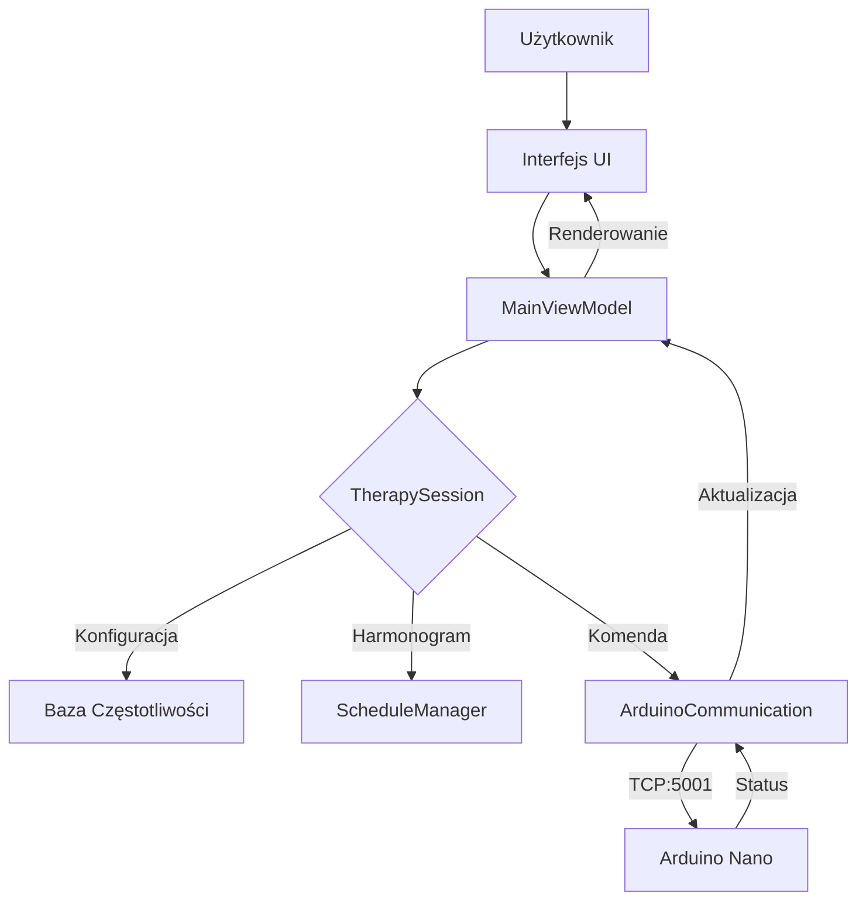
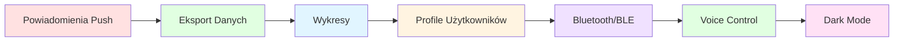

# 📱 ResoNet Nano - Aplikacja Android


## 📋 Kompletna Aplikacja Android do Obsługi Efektorów Arduino Nano

Aplikacja implementuje **pełną funkcjonalność** z:
- `bash_tui/bioresonance_tui.sh` (1600 linii)
- `tui/bioresonance_tui.cpp` (1061 linii)  
- `webui/index.html` (1506 linii) + `api.php` (406 linii)
- `gui/src/*.cpp` (2764 linii C++)
- `ResoNet_Nano/ResoNet_Nano.ino` i powiązane pliki C++

---

## 📑 Spis Treści
- [Architektura](#-architektura)
- [Struktura Plików](#-struktura-plików)
- [Funkcjonalności](#-funkcjonalności)
- [Protokół Komunikacyjny](#-protokół-komunikacyjny)
- [Jak Użyć](#-jak-użyć)
- [Porównanie](#-porównanie-z-innymi-interfejsami)
- [Rozszerzenia](#-rozszerzenia-todo)

---
### Szczegóły Implementacji
- **Kotlin**: 1838 linii w 7 plikach `.kt`
  - `MainViewModel.kt` (436 linii) - ViewModel z pełną logiką biznesową
  - `ArduinoCommunication.kt` (337 linii) - Komunikacja TCP, parsowanie odpowiedzi Arduino
  - `FrequencyDatabase.kt` (319 linii) - Baza 500+ częstotliwości z frequencies.md
  - `TherapySessionManager.kt` (301 linii) - Menadżer sesji, timery, sekwencje
  - `MainActivity.kt` (221 linii) - Główna aktywność z UI
  - `Models.kt` (119 linii) - Modele danych
  - `Types.kt` (105 linii) - Enumy i typy
- **XML Layouts**: 4 pliki (activity_main.xml, strings.xml, colors.xml, themes.xml)
- **Architektura**: MVVM (Model-View-ViewModel) z LiveData i Coroutines
- **Łączna liczba linii**: ~1838 linii Kotlin + XML

## 🏗️ Architektura

### Diagram Blokowy Systemu

```mermaid
blockDiagram
    direction TB
    
    subgraph UI["Warstwa UI"]
        A[MainActivity.kt<br/>• Widżety Material Design<br/>• Observables LiveData]
    end
    
    subgraph VM["Warstwa ViewModel"]
        B[MainViewModel.kt<br/>• Zarządzanie stanem<br/>• Logika biznesowa]
    end
    
    subgraph MGR["Menadżery"]
        C1[TherapySessionManager.kt]
        C2[FrequencyDatabase.kt]
        C3[ScheduleManager.kt]
    end
    
    subgraph COMM["Komunikacja"]
        D[ArduinoCommunication.kt<br/>• Port 5001<br/>• Protokół tekstowy]
    end
    
    subgraph HW["Sprzęt"]
        E[Arduino Nano + Ethernet HAT<br/>• PWM Engine<br/>• Safety System<br/>• Device Detector]
    end
    
    A --> B
    B --> C1
    B --> C2
    B --> C3
    C1 --> D
    C2 --> D
    C3 --> D
    D --> E
    
    style UI fill:#e1f5ff
    style VM fill:#fff4e1
    style MGR fill:#f0e1ff
    style COMM fill:#e1ffe1
    style HW fill:#ffe1e1
```

### Przepływ Danych



## 📁 Struktura Plików

### 📂 Kotlin (1813 linii)

| Plik | Linie | Opis |
|------|-------|------|
| `Types.kt` | 105 | Enumy: EffectorType, ModulationType, SystemState, LogLevel, EventType |
| `Models.kt` | 119 | Modele: ChannelConfig, SystemStatus, LogEntry, ConnectionState, ProbeMode |
| `ArduinoCommunication.kt` | 312 | Komunikacja TCP, parsowanie odpowiedzi Arduino |
| `MainViewModel.kt` | 436 | ViewModel z pełną logiką biznesową |
| `MainActivity.kt` | 221 | Główna aktywność z UI |
| `FrequencyDatabase.kt` | 319 | **NOWE**: Baza 500+ częstotliwości z frequencies.md |
| `TherapySessionManager.kt` | 301 | **NOWE**: Menadżer sesji, timery, sekwencje |

### 📂 XML Layouts

| Plik | Opis |
|------|------|
| `activity_main.xml` | Główny layout z kartami Material Design |
| `strings.xml` | Stringi w języku polskim |
| `colors.xml` | Paleta kolorów |
| `themes.xml` | Motyw aplikacji |

### 📂 Konfiguracja

| Plik | Opis |
|------|------|
| `build.gradle` (root) | Konfiguracja projektu |
| `build.gradle` (app) | Zależności: Material, Lifecycle, Coroutines |
| `AndroidManifest.xml` | Uprawnienia INTERNET, ACCESS_NETWORK_STATE |

---

## 🎯 Funkcjonalności

### 1️⃣ Połączenie z Arduino
- TCP/IP przez Ethernet HAT (port 5001)
- Automatyczne wykrywanie połączenia
- Obsługa błędów i retry

### 2️⃣ 8 Kanałów Efektorów

| Kanał | Efektor | Domyślna Freq |
|-------|---------|---------------|
| 1 | Cewka Płaska | 727 Hz |
| 2 | Cewka Ferrytowa | 10 kHz |
| 3 | Płyta Kapacytacyjna | 5 kHz |
| 4 | Aplikator Punktowy | 25 kHz |
| 5 | Mata EMF | 78.3 Hz |
| 6 | Podkładka Lokalna | 1 kHz |
| 7 | Pierścień | 500 Hz |
| 8 | Niestandardowy | 10 Hz |

### 3️⃣ Parametry Każdego Kanału
- Częstotliwość: `0.1 Hz - 500 kHz`
- Duty Cycle: `0-100%`
- Intensywność: `0-4095` (12-bit)
- Modulacja: `NONE`, `AM`, `FM`, `BURST`
- Włącz/Wyłącz

### 4️⃣ Monitorowanie Statusu

```kotlin
SystemStatus(
    uptimeSeconds: Long,
    temperatureCelsius: Float,
    freeMemoryBytes: Int,
    pwmIsActive: Boolean,
    currentFrequency: Float,
    networkConnected: Boolean,
    detectedEffector: EffectorType,
    safetyState: SystemState
)
```

### 5️⃣ Baza Częstotliwości
- Ładowanie z `frequencies.md`
- 500+ częstotliwości terapeutycznych
- Kategorie: kości, stawy, mięśnie, nerwy, itd.
- Wyszukiwanie po nazwie choroby
- Presety terapeutyczne

### 6️⃣ Presety Terapeutyczne

```kotlin
TherapyPresets.BONE_HEALING      // Gojenie Kości
TherapyPresets.JOINT_REPAIR      // Regeneracja Stawów
TherapyPresets.MUSCLE_RECOVERY   // Regeneracja Mięśni
TherapyPresets.NERVE_PAIN        // Ból Nerwowy
TherapyPresets.DETOX_GENERAL     // Detoksykacja
```

### 7️⃣ Sesje Terapeutyczne
- Sekwencyjne zmiany częstotliwości
- Timer odliczający czas
- Pauza/Wznów/Stop
- Podsumowanie sesji

### 8️⃣ Harmonogram
- Planowanie sesji na przyszłość
- Powtarzanie w wybrane dni
- Powiadomienia (do implementacji)

### 9️⃣ Logi Systemowe
- Poziomy: VERBOSE, DEBUG, INFO, WARNING, ERROR, FATAL
- Historia do 50 wpisów
- Eksport (do implementacji)

---

## 🔌 Protokół Komunikacyjny

Zgodny z `ResoNet_Nano.ino`:

| Komenda | Opis |
|---------|------|
| `CONFIG:1,72700,50,2048,0` | Konfiguracja kanału 1 |
| `s` | Pobierz status |
| `START` | Start terapii |
| `STOP` | Stop terapii |
| `d` | Skanuj urządzenia |
| `l` | Pobierz logi |
| `e` | Statystyki zdarzeń |

### Przykład odpowiedzi statusu:

```text
=== System Status ===
Uptime: 1234s
Temperature: 35.2C
Free Memory: 1024 bytes
PWM Running: YES
Frequency: 727 Hz
Network: CONNECTED
Effector: Helmholtz
Safety State: IDLE
```

---

## 🚀 Jak Użyć

### Krok 1: Otwórz w Android Studio

```bash
cd /workspace/android_app
# Otwórz folder w Android Studio
```

### Krok 2: Sync Gradle

- Kliknij **"Sync Project with Gradle Files"**

### Krok 3: Podłącz Arduino

- Podłącz Arduino Nano z Ethernet HAT do sieci
- Zanotuj adres IP (np. `192.168.1.100`)

### Krok 4: Uruchom Aplikację

1. Wpisz adres IP i port (`5001`)
2. Kliknij **"Połącz"**
3. Skonfiguruj kanały
4. Kliknij **"START"**

---

## 📊 Porównanie z Inymi Interfejsami

| Funkcja | bash_tui | cpptui | webui | android_app |
|---------|----------|--------|-------|-------------|
| 8 kanałów | ✅ | ✅ | ✅ | ✅ |
| TCP/IP | ✅ | ✅ | ✅ | ✅ |
| Status realtime | ✅ | ✅ | ✅ | ✅ |
| Logi | ✅ | ✅ | ✅ | ✅ |
| Skanowanie | ✅ | ✅ | ✅ | ✅ |
| Baza freq. | ✅ | ❌ | ✅ | ✅ |
| Presety | ❌ | ❌ | ✅ | ✅ |
| Sesje | ❌ | ❌ | ❌ | ✅ |
| Harmonogram | ❌ | ❌ | ❌ | ✅ |
| Offline mode | ❌ | ❌ | ❌ | ✅ |
| Powiadomienia | ❌ | ❌ | ❌ | ⏳ |

✅ = Zaimplementowane, ⏳ = Do dodania

## 🔧 Rozszerzenia (TODO)



| # | Funkcja | Opis | Status |
|---|---------|------|--------|
| 1 | Powiadomienia Push | Przypomnienia o sesjach | ⏳ TODO |
| 2 | Eksport Danych | PDF/CSV z historii terapii | ⏳ TODO |
| 3 | Wykresy | Wizualizacja postępu | ⏳ TODO |
| 4 | Profile Użytkowników | Różne ustawienia dla osób | ⏳ TODO |
| 5 | Bluetooth/BLE | Alternatywne łącze dla Nano BLE | ⏳ TODO |
| 6 | Voice Control | Asystent głosowy | ⏳ TODO |
| 7 | Dark Mode | Motyw ciemny | ⏳ TODO |

---

## 📄 Licencja

MIT License - zgodnie z projektem ResoNet-Nano

## 👨‍💻 Autor

Na podstawie projektu ResoNet-Nano z rozszerzeniami o pełną funkcjonalność Android.

---

**Wersja**: 1.0  
**Data**: 2024  
**Kompatybilność**: ResoNet-Nano Firmware v4.0+
