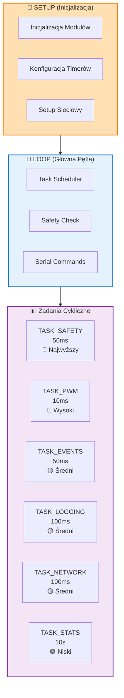
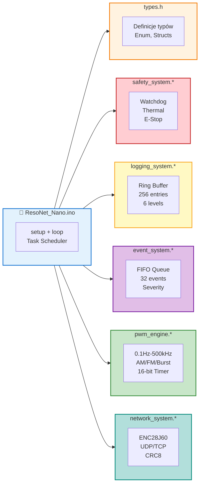
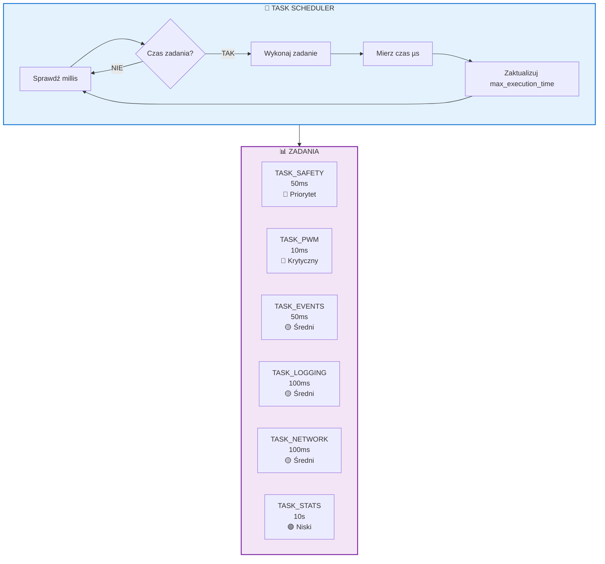

# 📘 Dokumentacja Arduino - ResoNet Nano

<div align="center">


**Profesjonalny system generatora sygnałów medycznych klasy IEC 60601-1**

[Architektura](#architektura-systemu) • [Moduły](#moduły-systemu) • [Pseudowielowątkowość](#pseudowielowątkowość) • [Konfiguracja](#konfiguracja-i-kompilacja) • [Bezpieczeństwo](#bezpieczeństwo-medyczne)

</div>

---

## 📋 Spis Treści

1. [Wprowadzenie](#wprowadzenie)
2. [Architektura Systemu](#architektura-systemu)
3. [Struktura Projektu](#struktura-projektu)
4. [Moduły Systemu](#moduły-systemu)
5. [Pseudowielowątkowość](#pseudowielowątkowość)
6. [Konfiguracja i Kompilacja](#konfiguracja-i-kompilacja)
7. [Komendy Debugowania](#komendy-debugowania)
8. [Bezpieczeństwo Medyczne](#bezpieczeństwo-medyczne)

---

## Wprowadzenie

**ResoNet Nano** to profesjonalny system generatora sygnałów medycznych klasy IEC 60601-1, zaimplementowany w C++ dla platformy Arduino Nano. System wykorzystuje architekturę modularną z pseudowielowątkowością, zapewniając deterministyczne czasy reakcji i wysokie bezpieczeństwo.

### Kluczowe Cechy

- ✅ **100% C++** - Zero zależności od Pythona
- ✅ **Architektura Modularna** - 5 niezależnych modułów
- ✅ **Pseudowielowątkowość** - Kooperacyjne wielozadaniowość
- ✅ **Non-blocking Timing** - Wszystkie operacje oparte na `millis()`
- ✅ **Bezpieczeństwo Medyczne** - Zgodność z IEC 60601-1
- ✅ **Watchdog Timer** - Wielopoziomowy monitoring
- ✅ **Ring Buffer Logów** - 256 wpisów historii
- ✅ **Event Queue** - Kolejka FIFO 32 zdarzeń

---

## Architektura Systemu

### Diagram Blokowy Architektury

```mermaid
blockDiagram
    title "ResoNet-Nano - Architektura Oprogramowania"
    
    block:Main["📄 ResoNet_Nano.ino<br/>Task Scheduler<br/>Setup + Loop"]
        style fill:#e3f2fd,stroke:#1976d2,stroke-width:2px
    end
    
    block:Safety["🛡️ safety_system<br/>50ms<br/>Watchdog + Thermal"]
        style fill:#ffcdd2,stroke:#c62828,stroke-width:2px
    end
    
    block:Logging["📝 logging_system<br/>100ms<br/>Ring Buffer 256"]
        style fill:#fff9c4,stroke:#f9a825,stroke-width:2px
    end
    
    block:Events["⚡ event_system<br/>50ms<br/>FIFO 32 events"]
        style fill:#e1bee7,stroke:#7b1fa2,stroke-width:2px
    end
    
    block:PWM["🎛️ pwm_engine<br/>10ms<br/>0.1Hz-500kHz"]
        style fill:#c8e6c9,stroke:#388e3c,stroke-width:2px
    end
    
    block:Network["🌐 network_system<br/>100ms<br/>ENC28J60 SPI"]
        style fill:#b2dfdb,stroke:#00897b,stroke-width:2px
    end
    
    Main --> Safety
    Main --> Logging
    Main --> Events
    Main --> PWM
    Main --> Network
    
    classDef default text-align:left,font-family:monospace;
```

### Przepływ Danych Systemu



---

## Struktura Projektu

### Drzewo Plików



### Opis Plików

| Plik | Linie | Odpowiedzialność |
|------|-------|------------------|
| `types.h` | ~120 | Centralne definicje typów, enum, struktur |
| `safety_system.*` | ~360 | Watchdog, temperatura, emergency shutdown |
| `logging_system.*` | ~250 | Ring buffer logów, 6 poziomów logowania |
| `event_system.*` | ~270 | Kolejka FIFO zdarzeń, severity levels |
| `pwm_engine.*` | ~400 | Generator PWM 0.1Hz-500kHz, modulacje AM/FM/Burst |
| `network_system.*` | ~300 | ENC28J60, UDP/TCP, CRC8 validation |
| `ResoNet_Nano.ino` | ~470 | Task scheduler, Serial commands |

**Razem: ~2170 linii czystego C++**

---

## Moduły Systemu

### 1. safety_system (Bezpieczeństwo)

**Odpowiedzialność:**
- Watchdog Timer z 4 warstwami monitorowania
- Pomiar temperatury MCU (wewnętrzny czujnik)
- Emergency shutdown z latch'em
- Historia resetów w EEPROM
- Stan lockout po przekroczeniu progu resetów

**Warstwy Watchdog:**
```cpp
#define WDT_LAYER_MAIN      0x01   // Główna pętla
#define WDT_LAYER_NETWORK   0x02   // Komunikacja sieciowa
#define WDT_LAYER_THERAPY   0x04   // Generator PWM
#define WDT_LAYER_COMMS     0x08   // Komunikacja szeregowa
```

**Procedura Emergency:**
1. Wykrycie błędu krytycznego (przegrzanie, timeout WDT)
2. Ustawienie flagi `emergency_latch = true`
3. Natychmiastowe zatrzymanie PWM
4. Wejście w stan `SAFE_STATE_CRITICAL`
5. Wymagany manualny reset po usunięciu przyczyny

### 2. logging_system (Logowanie)

**Konfiguracja:**
```cpp
#define LOG_BUFFER_SIZE 256        // Ring buffer entries
#define LOG_MESSAGE_MAX_LEN 64     // Max długość wiadomości
#define CURRENT_LOG_LEVEL LOG_VERBOSE  // Poziom logowania
```

**Poziomy Logowania:**
| Poziom | Wartość | Opis |
|--------|---------|------|
| `LOG_VERBOSE` | 0 | Szczegółowe informacje debug |
| `LOG_DEBUG` | 1 | Informacje diagnostyczne |
| `LOG_INFO` | 2 | Standardowe informacje |
| `LOG_WARNING` | 3 | Ostrzeżenia |
| `LOG_ERROR` | 4 | Błędy |
| `LOG_FATAL` | 5 | Błędy krytyczne |

**Makra Logowania:**
```cpp
LOG_INFO("System started");
LOG_ERROR_F("Temperature critical: %d°C", temp);
LOG_EVENT(LOG_FATAL, EVENT_SAFETY_TRIP, "Emergency triggered");
```

### 3. event_system (Zdarzenia)

**Kolejka FIFO:**
- Rozmiar: 32 zdarzenia
- Typy: INFO, WARNING, ERROR, CRITICAL
- Counter utraconych zdarzeń (overflow)

**Typy Zdarzeń:**
```cpp
EVENT_NONE, EVENT_CMD_RECEIVED, EVENT_PWM_START,
EVENT_SAFETY_TRIP, EVENT_WATCHDOG_FEED, EVENT_THERMAL_WARN,
EVENT_SYSTEM_RESET, EVENT_THERAPY_COMPLETE, ...
```

**Makra Eventów:**
```cpp
EVENT_INFO(EVENT_PWM_START, "Therapy initiated");
EVENT_WARNING(EVENT_THERMAL_WARN, "Temp > 70°C");
EVENT_CRITICAL(EVENT_SAFETY_TRIP, "Emergency stop");
```

### 4. pwm_engine (Generator Sygnałów)

**Specyfikacja:**
- Zakres częstotliwości: **0.1 Hz - 500 kHz**
- Rozdzielczość: **0.01 Hz** (wartości * 100)
- Duty Cycle: **0-100%**
- Timer: **Timer1** (pin 9, OC1A)
- Tryb: **Fast PWM z ICR1 jako TOP** (tryb 14)

**Modulacje:**
| Typ | Opis | Częstotliwość Modulacji |
|-----|------|------------------------|
| `MODULATION_NONE` | Brak modulacji | - |
| `MODULATION_AM` | Amplitudy (sinus) | 1 Hz |
| `MODULATION_FM` | Częstotliwości (±10%) | 0.5 Hz |
| `MODULATION_BURST` | Burst (on/off) | 1 Hz (500ms on/off) |

**Przykład Konfiguracji:**
```cpp
PWMConfig config;
config.frequency_hz_x100 = 72700;  // 727.00 Hz
config.duty_cycle = 50;            // 50%
config.modulation_type = MODULATION_AM;
config.intensity_level = 2048;     // 0-4095
config.duration_ms = 5000;         // 5 sekund

pwm_set_config(&config);
pwm_start();
```

### 5. network_system (Komunikacja)

**Sprzęt:**
- Moduł: **ENC28J60** (Ethernet)
- Interfejs: **SPI** (pin 10 = CS)
- Porty: **UDP 5000**, **TCP 5001**

**Format Pakietów:**
```cpp
// Pakiet Terapii (binarny)
typedef struct {
    uint32_t frequency_hz_x100;
    uint32_t duration_sec;
    uint8_t modulation_type;
    uint8_t duty_cycle;
    uint16_t intensity_level;
    uint8_t checksum;  // CRC8
} TherapyPacket;
```

**CRC8:**
- Wielomian: **0x07** (standardowy)
- Obliczanie dla każdego pakietu
- Weryfikacja przed przetworzeniem

---

## Pseudowielowątkowość

### Task Scheduler - Diagram Przepływu



### Tabela Zadań

| Zadanie | Interwał | Priorytet | Odpowiedzialność |
|---------|----------|-----------|------------------|
| `TASK_SAFETY` | 50ms | 🔴 Najwyższy | Watchdog feed, thermal check |
| `TASK_PWM` | 10ms | 🔴 Wysoki | Modulacje, timing krytyczny |
| `TASK_EVENTS` | 50ms | 🟡 Średni | Processing event queue |
| `TASK_LOGGING` | 100ms | 🟡 Średni | Log buffer management |
| `TASK_NETWORK` | 100ms | 🟡 Średni | Packet processing |
| `TASK_STATS` | 10s | 🟢 Niski | Statistics, memory check |

### Implementacja

```cpp
typedef struct {
    uint32_t last_run;          // Ostatnie wykonanie
    uint32_t interval;          // Interwał w ms
    uint32_t execution_count;   // Licznik wykonań
    uint32_t max_execution_time;// Najdłuższe wykonanie (µs)
    bool enabled;               // Flaga aktywności
} TaskControl;
```

### Non-blocking Timing

Wszystkie zadania używają `millis()` zamiast `delay()`:

```cpp
static bool should_run_task(TaskControl* task, uint32_t now) {
    if (!task->enabled) return false;
    if (now - task->last_run >= task->interval) {
        task->last_run = now;
        task->execution_count++;
        return true;
    }
    return false;
}
```

### Performance Monitoring

Każde zadanie mierzy czas wykonania:
```cpp
uint32_t start = micros();
// ... kod zadania ...
uint32_t elapsed = micros() - start;
if (elapsed > task->max_execution_time) {
    task->max_execution_time = elapsed;
}
```

---

## Konfiguracja i Kompilacja

### Wymagania

- **Arduino IDE** 1.8.x lub 2.x
- **Płytka:** Arduino Nano (ATmega328P)
- **Biblioteki:**
  - `EthernetENC` (dla ENC28J60) - opcjonalnie jeśli używasz sieci

### Instalacja

1. Otwórz Arduino IDE
2. Przejdź do: `Plik → Preferencje`
3. Dodaj dodatkowe menedżery płytek (jeśli potrzebne)
4. Zainstaluj bibliotekę: `Szkic → Dołącz bibliotekę → Zarządzaj bibliotekami`
   - Wyszukaj: `EthernetENC`
   - Zainstaluj wersję najnowsza

### Kompilacja

1. Otwórz plik: `ResoNet_Nano/ResoNet_Nano.ino`
2. Wybierz płytkę: `Narzędzia → Płytka → Arduino Nano`
3. Wybierz procesor: `Narzędzia → Procesor → ATmega328P`
4. Wybierz port: `Narzędzia → Port → COMx` (Windows) lub `/dev/ttyUSBx` (Linux)
5. Kliknij: `Szkic → Wgraj` (Ctrl+U)

### Konfiguracja Compile-time

Edytuj `types.h` aby zmienić:
```cpp
#define PIN_PWM_OUTPUT      9    // Pin PWM
#define PIN_ENC28J60_CS     10   // Chip Select Ethernet
#define PIN_TEMP_SENSOR     A0   // Czujnik temperatury
#define PIN_EMERGENCY_STOP  3    // Przycisk E-Stop
```

---

## Komendy Debugowania

Po podłączeniu przez USB i otwarciu monitora szeregowego (115200 baud):

| Komenda | Opis |
|---------|------|
| `s` | **Status** - Pełny raport systemu |
| `t` | **Test PWM** - Uruchom 727 Hz na 5s |
| `x` | **Stop PWM** - Zatrzymaj generator |
| `l` | **Log History** - Pokaż 256 ostatnich logów |
| `e` | **Event Stats** - Statystyki zdarzeń |
| `h` | **Help** - Lista komend |

### Przykład Outputu Statusu

```
=== System Status ===
Uptime: 125s
Free Memory: 1847 bytes
Loop Count: 98234
Tasks Executed: 45678
Safety State: 0
Temperature: 32 C
PWM Running: YES
Frequency: 727.00 Hz
Network: CONNECTED
```

---

## Bezpieczeństwo Medyczne

### Zgodność z IEC 60601-1

System implementuje następujące mechanizmy bezpieczeństwa:

#### 1. Ochrona Przed Przegrzaniem
- **Threshold ostrzeżenia:** 70°C
- **Threshold krytyczny:** 85°C
- **Histereza:** 5°C
- **Akcja:** Natychmiastowy shutdown przy 85°C

#### 2. Watchdog Timer
- **Timeout:** 2 sekundy
- **Reset threshold:** 5 resetów
- **Lockout:** Po 5 resetach wejście w tryb bezpieczny
- **4 warstwy monitorowania:** Main, Network, Therapy, Comms

#### 3. Emergency Latch
- **Aktywacja:** Przycisk fizyczny (pin 3, LOW active)
- **Latch:** Wymaga manualnego resetu
- **Priorytet:** Najwyższy - natychmiastowe przerwanie PWM

#### 4. Walidacja Parametrów
- **Guard Clauses** dla wszystkich wejść
- **CRC8** dla pakietów sieciowych
- **Range Checking** częstotliwości i duty cycle

#### 5. Pamięć EEPROM
- **Licznik resetów** persistowany
- **Flagi błędów** po restarcie
- **Diagnostyka** przyczyn resetu (MCUSR)

### Procedury Awaryjne

**Scenariusz: Przegrzanie**
1. Wykrycie temp > 85°C
2. Ustawienie `SAFE_STATE_CRITICAL`
3. Zatrzymanie PWM
4. Zapis błędu do EEPROM
5. Migawka diody statusu
6. Wymagany cool-down przed restartem

**Scenariusz: Watchdog Timeout**
1. Brak feeda przez 2s
2. Hardware reset MCU
3. Odczyt MCUSR → wykrycie WDRF
4. Inkrementacja licznika w EEPROM
5. Jeśli count ≥ 5 → `SAFE_STATE_LOCKOUT`
6. Blokada pracy do manualnego resetu

---

## Rozwiązywanie Problemów

### Problem: Kompilacja nie powiada się

**Rozwiązanie:**
- Sprawdź czy wszystkie pliki `.h` i `.cpp` są w tym samym folderze co `.ino`
- Upewnij się że `types.h` jest dołączony pierwszą kolejką
- Zrestartuj Arduino IDE

### Problem: Watchdog ciągle resetuje

**Diagnostyka:**
```
Komenda 's' → Safety State: 4 (LOCKOUT)
```

**Rozwiązanie:**
1. Sprawdź przyczynę (przegrzanie? zawieszenie sieci?)
2. Wyczyść EEPROM programatorem lub zmień `WDT_RESET_THRESHOLD`
3. Zoptymalizuj najwolniejsze zadanie (sprawdź `max_execution_time`)

### Problem: Brak komunikacji sieciowej

**Checklista:**
- [ ] Czy moduł ENC28J60 jest podłączony do pinów 10, 11, 12, 13?
- [ ] Czy zasilanie 3.3V jest stabilne?
- [ ] Czy kabel Ethernet jest sprawny?
- [ ] Czy IP jest poprawnie skonfigurowane?

---

## Changelog

### v4.0 (Current)
- ✅ Podział na moduły (.h + .cpp)
- ✅ Pseudowielowątkowość z 6 zadaniami
- ✅ Centralny plik `types.h`
- ✅ Poprawione spójności typów (LOG_FATAL vs LOG_LEVEL_FATAL)
- ✅ Dodane brakujące enumeracje eventów
- ✅ Non-blocking timing we wszystkich modułach

### v3.1
- Poprawiona atomowość zmiennych współdzielonych
- Eliminacja dynamicznej alokacji pamięci
- Watchdog z licznikiem resetów w EEPROM

### v3.0
- Pierwsza wersja modularna
- System logowania z ring bufferem
- Event queue FIFO

---

## Kontakt i Wsparcie

Dokumentacja zgodna z wersją firmware **4.0.0**

**Autor:** ResoNet Development Team  
**Licencja:** MIT (sprzęt), GPL v3 (oprogramowanie)  
**Normy:** IEC 60601-1 (klasa IIa urządzenia medyczne)
