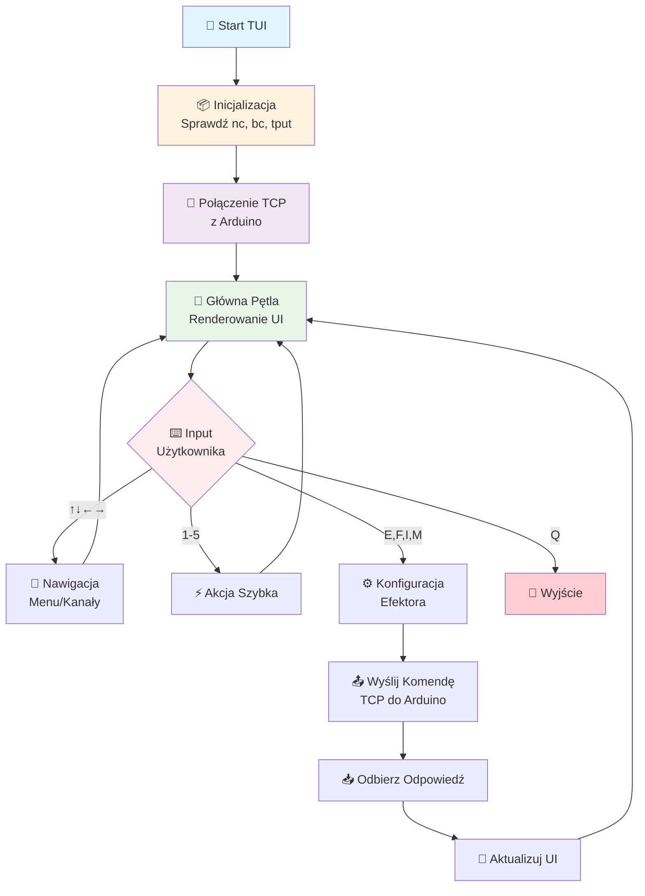

# 🖥️ Bioresonance TUI - Terminalowy Interfejs Użytkownika (BASH)


## 📋 Spis Treści

- [Opis](#-opis)
- [Architektura Systemu](#-architektura-systemu)
- [Wymagania](#-wymagania)
- [Uruchomienie](#-uruchomienie)
- [Sterowanie](#-sterowanie)
- [Obsługiwane Końcówki](#-obsługiwane-końcówki-biorezonansowe)
- [Tryby Pracy](#-tryby-pracy)
- [Parametry Konfiguracyjne](#-parametry-konfiguracyjne)
- [Panel Statusu](#-panel-statusu)
- [Bezpieczeństwo](#-bezpieczeństwo)
- [Przykłady Użycia](#-przykłady-użycia)
- [Rozwiązywanie Problemów](#-rozwiązywanie-problemów)

---

## 📋 Opis

Profesjonalny terminalowy interfejs użytkownika (TUI) do sterowania systemem biorezonansu **ResoNet-Nano** z Arduino Nano i Ethernet HAT. Aplikacja umożliwia konfigurację i obsługę licznych końcówek biorezonansowych w trybie pojedynczym i wielokanałowym.

**Wersja Bash** - implementacja w czystym shell script bez zależności od C++, Python czy innych języków kompilowanych.

---

## 🏗️ Architektura Systemu

```mermaid
blockDiagram
    direction TB
    
    User["👤 Użytkownik (Terminal)"]
    TUI["🖥️ BASH TUI Interface"]
    NetCat["🌐 netcat (TCP/IP)"]
    Ethernet["🔌 Ethernet HAT"]
    Arduino["🧠 Arduino Nano MCU"]
    PWM["⚡ PWM Generator"]
    Effectors["🔋 Efektor: 8 Kanałów"]
    
    User -->|Klawisze/Nawigacja | TUI
    TUI -->|Komendy TCP | NetCat
    NetCat -->|Port 5001 | Ethernet
    Ethernet -->|SPI | Arduino
    Arduino -->|PWM Signals | PWM
    PWM -->|Wyjścia | Effectors
    
    style User fill:#e1f5fe
    style TUI fill:#fff3e0
    style NetCat fill:#f3e5f5
    style Ethernet fill:#e8f5e9
    style Arduino fill:#ffebee
    style PWM fill:#fff8e1
    style Effectors fill:#fce4ec
```



---

## 🔧 Wymagania

### Systemowe
- **System operacyjny**: Linux z bashem w wersji 4.0+
- **Narzędzia**: 
  - `nc` (netcat) - do komunikacji sieciowej TCP
  - `bc` - do obliczeń matematycznych
  - `tput` - do manipulacji terminalem
  - `timeout` - do kontroli czasu połączenia

### Instalacja zależności

```bash
# Ubuntu/Debian
sudo apt-get update
sudo apt-get install netcat-openbsd bc

# Fedora/RHEL
sudo dnf install ncurses bc

# Arch Linux
sudo pacman -S gnu-netcat bc
```

## 🚀 Uruchomienie

### Szczegóły Implementacji
- **Plik źródłowy**: `bioresonance_tui.sh` (1600 linii)
- **Język**: Bash 4.0+
- **Zależności**: netcat (`nc`), `bc`, `tput`, `timeout`
- **Tryby pracy**: Interaktywny TUI + Direct Control Mode (CLI)

### Tryb TUI (Interaktywny)

```bash
cd /workspace/bash_tui

# Nadaj uprawnienia wykonania (jeśli jeszcze nie nadane)
chmod +x bioresonance_tui.sh

# Podstawowe użycie (domyślny IP i port)
./bioresonance_tui.sh

# Z podaniem adresu IP urządzenia
./bioresonance_tui.sh 192.168.1.100

# Z podaniem IP i portu
./bioresonance_tui.sh 192.168.1.100 5001

# Tryb verbose/debug
./bioresonance_tui.sh -v 192.168.1.100
./bioresonance_tui.sh --debug
```

### Tryb Bezpośredni (Direct Control Mode)

Tryb bezpośredni pozwala na sterowanie efektorami z linii poleceń bez uruchamiania interfejsu TUI. Idealny do skryptów i automatyzacji.

```bash
# Podstawowa składnia:
./bioresonance_tui.sh -c channel:frequency[:duty:intensity:modulation]

# Przykłady:

# Aktywuj kanał 1 (Cewka Płaska) z częstotliwością 727 Hz
./bioresonance_tui.sh -c 1:727

# Kanał 1, 727 Hz, cykl pracy 50%
./bioresonance_tui.sh -c 1:727:50

# Kanał 1, 727 Hz, 50% duty, intensywność 2048
./bioresonance_tui.sh -c 1:727:50:2048

# Kanał 1 z modulacją AM
./bioresonance_tui.sh -c 1:727:50:2048:AM

# Wiele kanałów jednocześnie
./bioresonance_tui.sh -c 1:727 -c 2:10000 -c 5:78.3

# Z customowym adresem IP
./bioresonance_tui.sh 192.168.1.50 -c 1:727:50:2048:NONE

# Pełna konfiguracja z modulacją FM
./bioresonance_tui.sh -c 3:5000:60:3000:FM
```

#### Format argumentu `-c` / `--control`:

```
channel:frequency[:duty:intensity:modulation]
```

- **channel** (wymagane): Numer kanału 1-8
- **frequency** (wymagane): Częstotliwość w Hz (może być dziesiętna, np. 78.3)
- **duty** (opcjonalne, domyślnie 50): Cykl pracy w zakresie 0-100%
- **intensity** (opcjonalne, domyślnie 2048): Intensywność w zakresie 0-4095
- **modulation** (opcjonalne, domyślnie NONE): Typ modulacji (NONE, AM, FM, BURST, SWEEP)

## 🎮 Sterowanie

### Nawigacja

| Klawisz | Funkcja |
|:-------:|---------|
| `↑` `↓` | 🧭 Nawigacja w menu głównym |
| `←` `→` | 🔀 Wybór kanału/końcówki |
| `Q`     | 🚪 Wyjście z aplikacji |

### Akcje Szybkie

| Klawisz | Funkcja |
|:-------:|---------|
| `1`     | 🎛️ Edycja częstotliwości wybranej końcówki |
| `2`     | 🔄 Wybór trybu pracy |
| `3`     | ▶️ Start terapii |
| `4`     | ⏹️ Stop terapii |
| `5`     | 🔄 Odśwież status systemu |
| `E`     | ⚡ Włącz/Wyłącz wybraną końcówkę |
| `F`     | 🎚️ Edycja częstotliwości |
| `I`     | 📈 Edycja intensywności |
| `M`     | 📡 Zmiana modulacji |
| `S`     | 🔄 Odśwież status |
| `H`     | ❓ Wyświetl pomoc |

---

## 🔌 Obsługiwane Końcówki Biorezonansowe

### 1. **Cewka Płaska (Flat Coil)**
- **Zastosowanie**: 🎯 Terapia powierzchniowa, punkty akupunkturowe
- **Domyślna częstotliwość**: `727 Hz`
- **Kanał**: `1`

### 2. **Cewka Ferrytowa (Ferrite Rod)**
- **Zastosowanie**: 🎯 Terapia głęboka, narządy wewnętrzne
- **Domyślna częstotliwość**: `10 kHz`
- **Kanał**: `2`

### 3. **Płyta Kapacytacyjna (Capacitive Plate)**
- **Zastosowanie**: 🎯 Aplikacje ogólnoustrojowe
- **Domyślna częstotliwość**: `5 kHz`
- **Kanał**: `3`

### 4. **Aplikator Punktowy (Pen Applicator)**
- **Zastosowanie**: 🎯 Terapia punktowa, precyzyjna
- **Domyślna częstotliwość**: `25 kHz`
- **Kanał**: `4`

### 5. **Mata EMF (EMF Mat)**
- **Zastosowanie**: 🎯 Terapia całego ciała
- **Domyślna częstotliwość**: `78.3 Hz` (rezonans Schumanna)
- **Kanał**: `5`

### 6. **Podkładka Lokalna (Local Pad)**
- **Zastosowanie**: 🎯 Aplikacje lokalne na konkretne obszary
- **Domyślna częstotliwość**: `1 kHz`
- **Kanał**: `6`

### 7. **Pierścień (Ring Applicator)**
- **Zastosowanie**: 🎯 Kończyny, palce
- **Domyślna częstotliwość**: `500 Hz`
- **Kanał**: `7`

### 8. **Konfiguracja Niestandardowa (Custom)**
- **Zastosowanie**: 🎯 Dowolna konfiguracja użytkownika
- **Domyślna częstotliwość**: `10 Hz`
- **Kanał**: `8`

---

## 🔄 Tryby Pracy

### Pojedyncza (SINGLE)
- 🎯 Tylko jedna aktywna końcówka w danym czasie

### Dual Niezależny (DUAL_INDEPENDENT)
- 🔀 Dwie niezależne końcówki pracujące jednocześnie
- ⚙️ Każda z własną konfiguracją częstotliwości

### Dual Sync (DUAL_SYNC)
- 🔗 Dwie zsynchronizowane końcówki
- 📊 Ta sama częstotliwość, faza synchronizowana

### Wielokanałowa (MULTI_CHANNEL)
- 🎛️ Do 8 końcówek pracujących jednocześnie
- ⚙️ Każda z indywidualną konfiguracją

### Sekwencyjna (SEQUENTIAL)
- 🔄 Rotacyjne włączanie końcówek w zadanej sekwencji
- ⏱️ Automatyczne przełączanie co określony czas

---

## ⚙️ Parametry Konfiguracyjne

### Częstotliwość
- 📊 **Zakres**: `0.1 Hz` - `500 kHz`
- 🎯 **Rozdzielczość**: `0.01 Hz`
- 📏 **Jednostka**: Hz

### Cykl Pracy (Duty Cycle)
- 📊 **Zakres**: `1%` - `99%`
- 🔧 **Domyślnie**: `50%`

### Intensywność
- 📊 **Zakres**: `0` - `4095` (12-bit)
- 🔧 **Domyślnie**: `2048`

### Modulacje

| Typ | Opis | Parametry |
|:---:|------|-----------|
| `NONE` | 🚫 Brak modulacji | - |
| `AM`   | 📈 Modulacja amplitudy | `1 Hz` |
| `FM`   | 📡 Modulacja częstotliwości | `±10%`, `0.5 Hz` |
| `BURST`| 💥 Impulsowa | `500ms on/off` |
| `SWEEP`| 🔄 Przemiatający zakres | - |

---

## 📊 Panel Statusu

Aplikacja wyświetla na bieżąco:

| Parametr | Opis |
|----------|------|
| 🌡️ Temperatura MCU | Temperatura procesora Arduino |
| 💾 Wolna pamięć RAM | Dostępna pamięć operacyjna |
| ⏱️ Czas pracy (uptime) | Czas od uruchomienia systemu |
| ⚡ Stan PWM | `ACTIVE` / `STOPPED` |
| 📊 Aktualna częstotliwość | Bieżąca wartość Hz |
| 🌐 Status połączenia | Stan połączenia sieciowego |
| 🛡️ System bezpieczeństwa | Status zabezpieczeń |

---

## 🔐 Bezpieczeństwo

⚠️ **WAŻNE**: Przed użyciem urządzenia medycznego:

1. 🔌 **Sprawdź izolację galwaniczną**
2. 📊 **Zweryfikuj parametry wyjściowe oscyloskopem**
3. 📋 **Przestrzegaj norm IEC 60601-1**
4. 👨‍⚕️ **Konsultuj się z profesjonalistą**

---

## 📝 Przykłady Użycia

### Sesja podstawowa - cewka płaska (TUI)
```bash
# 1. Uruchom TUI
./bioresonance_tui.sh 192.168.1.100

# 2. Wybierz kanał 1 (cewka płaska) strzałkami
# 3. Naciśnij 'E' aby aktywować
# 4. Naciśnij 'F' i ustaw 727 Hz
# 5. Naciśnij '3' aby rozpocząć terapię
# 6. Po zakończeniu naciśnij '4'
```

### Terapia wielokanałowa (TUI)
```bash
# 1. Aktywuj kanały 1, 3, 5 (E dla każdego)
# 2. Ustaw różne częstotliwości (F)
# 3. Wybierz tryb MULTI_CHANNEL (klawisz 2)
# 4. Start terapii (klawisz 3)
```

### Sterowanie bezpośrednie z linii poleceń (Direct Control Mode)

#### Podstawowe użycie
```bash
# Aktywuj kanał 1 z częstotliwością 727 Hz
./bioresonance_tui.sh -c 1:727

# Kanał 1 z pełną konfiguracją
./bioresonance_tui.sh -c 1:727:50:2048:NONE

# Wiele kanałów jednocześnie
./bioresonance_tui.sh -c 1:727 -c 2:10000 -c 5:78.3
```

#### Skrypt automatyzujący sesję
```bash
#!/bin/bash
# Przykładowy skrypt uruchamiający terapię

DEVICE="192.168.1.100"

# Uruchom terapię na kanałach 1 i 5
./bioresonance_tui.sh $DEVICE \
    -c 1:727:50:2048:NONE \
    -c 5:78.3:50:2048:NONE

echo "Terapia rozpoczęta"
```

#### Integracja z innymi narzędziami
```bash
# Uruchom terapię na podstawie pliku konfiguracyjnego
while IFS=: read -r channel freq duty intensity mod; do
    controls+=("-c" "$channel:$freq:$duty:$intensity:$mod")
done < config.txt

./bioresonance_tui.sh "${controls[@]}"
```

## 🛠️ Różnice względem wersji C++

| Cecha | Wersja C++ | Wersja BASH |
|:------|:-----------|:------------|
| 🚀 Wydajność | Wysoka | Średnia |
| 📦 Zależności | ncurses | netcat, bc, tput |
| 🔨 Kompilacja | Wymagana | Nie wymaga |
| 🌍 Portowalność | Ograniczona | Wysoka |
| ✏️ Modyfikacje | Trudniejsze | Łatwe |
| 🐛 Debugowanie | Trudne | Łatwe |

---

## 🐛 Rozwiązywanie Problemów

### Błąd: nc (netcat) nie jest zainstalowany
```bash
Rozwiązanie: Zainstaluj netcat:
sudo apt-get install netcat-openbsd
```

### Błąd: bc: command not found
```bash
Rozwiązanie: Zainstaluj bc:
sudo apt-get install bc
```

### Błąd połączenia
```bash
Rozwiązanie: Sprawdź czy Arduino jest podłączone do sieci
i ma poprawny adres IP. Pinguj urządzenie: ping 192.168.1.100
```

### Brak odpowiedzi
```bash
Rozwiązanie: Restart Arduino, sprawdź kabel Ethernet,
zweryfikuj konfigurację sieciową
```

### Problem z kolorami w terminalu
```bash
Rozwiązanie: Upewnij się, że terminal obsługuje kolory ANSI.
Spróbuj ustawić: export TERM=xterm-256color
```

---

## 📄 Licencja

MIT License - patrz główny plik LICENSE projektu ResoNet-Nano.

## 👨‍💻 Autor

ResoNet Development Team - Profesjonalne Systemy Biorezonansu

---

**Wersja**: `1.0` (BASH)  
**Data**: `2024`  
**Kompatybilność**: ResoNet-Nano Firmware `v4.0+`  
**Wymagany bash**: `4.0+`
