# 🔌 ResoNet-Nano: Dokumentacja Sprzętowa (Hardware Documentation)

<div align="center">

-blue)


**Kompletna dokumentacja połączeń, komponentów i montażu systemu biorezonansu ResoNet-Nano**

[Schemat Połączeń](#-schemat-połączeń-i-pinout) • [Opis Elementów](#-opis-elementów-sprzętowych) • [Połączenia Pinów](#-szczegółowe-połączenia-pinów) • [Elementy Dodatkowe](#-elementy-dodatkowe-i-akcesoria) • [Elementy Mechaniczne](#-elementy-mechaniczne-i-obudowa) • [Bezpieczeństwo Montażu](#-bezpieczeństwo-montażu-i-testy)

</div>

---

## 📋 Spis Treści

- [Schemat Połączeń i Pinout](#-schemat-połączeń-i-pinout)
  - [Diagram Blokowy Systemu](#diagram-blokowy-systemu)
  - [Schemat Elektryczny Połączeń](#schemat-elektryczny-połączeń)
- [Opis Elementów Sprzętowych](#-opis-elementów-sprzętowych)
- [Szczegółowe Połączenia Pinów](#-szczegółowe-połączenia-pinów)
- [Elementy Dodatkowe i Akcesoria](#-elementy-dodatkowe-i-akcesoria)
- [Elementy Mechaniczne i Obudowa](#-elementy-mechaniczne-i-obudowa)
- [Bezpieczeństwo Montażu i Testy](#-bezpieczeństwo-montażu-i-testy)
- [Odniesienia i Pliki Powiązane](#-odniesienia-i-pliki-powiązane)

---

## 🔌 Schemat Połączeń i Pinout

### 📊 Diagram Blokowy Systemu

```mermaid
flowchart TD
    subgraph Zasilacz["⚡ ZASILACZ MEDYCZNY<br/>5V/2A, IEC 60601-1"]
        direction TB
        Z5V["5V DC"]
        ZGND["GND"]
    end
    
    subgraph Arduino["🧠 ARDUINO NANO<br/>ATmega328P, 16MHz"]
        direction TB
        A_D5["D5 - IR_PWM"]
        A_D9["D9 - PWM_OUT"]
        A_D10["D10 - SPI CS"]
        A_D11["D11 - SPI MOSI"]
        A_D12["D12 - SPI MISO"]
        A_D13["D13 - SPI SCK"]
        A_5V["5V"]
        A_GND["GND"]
        A_3V3["3.3V LDO"]
    end
    
    subgraph Ethernet["🌐 ENC28J60<br/>ETHERNET MODULE<br/>SPI, 10Mbps"]
        direction TB
        E_CS["Pin 2 - CS"]
        E_SI["Pin 5 - SI/MOSI"]
        E_SO["Pin 6 - SO/MISO"]
        E_SCK["Pin 4 - SCK"]
        E_VREG["Pin 8 - VREG 3.3V"]
        E_GND["Pin 3 - GND"]
    end
    
    subgraph IzolacjaDC["🔒 IZOLACJA DC-DC<br/>2500V RMS<br/>B0505S-1W"]
        direction TB
        I_IN5V["5V IN"]
        I_INGND["GND IN"]
        I_OUT5V["5V_ISO OUT"]
        I_OUTGND["AGND OUT"]
    end
    
    subgraph IzolacjaDCIR["🔒 IZOLACJA DC-DC IR<br/>2500V RMS<br/>B0505S-2W"]
        direction TB
        IR_IN5V["5V IN"]
        IR_INGND["GND IN"]
        IR_OUT5V["5V_ISO_IR OUT"]
        IR_OUTGND["GND_ISO_IR OUT"]
    end
    
    subgraph OptoPWM["🔒 OPTOIZOLATOR PWM<br/>6N137<br/>10 MHz"]
        direction TB
        OP_ANODE["Anode Pin 1"]
        OP_CATHODE["Cathode Pin 2"]
        OP_EMITTER["Emitter Pin 4"]
        OP_COLLECTOR["Collector Pin 5"]
        OP_VCC["VCC Pin 8"]
    end
    
    subgraph OptoIR["🔒 OPTOIZOLATOR IR<br/>6N137<br/>10 MHz"]
        direction TB
        OI_ANODE["Anode Pin 1"]
        OI_CATHODE["Cathode Pin 2"]
        OI_EMITTER["Emitter Pin 4"]
        OI_COLLECTOR["Collector Pin 5"]
        OI_VCC["VCC Pin 8"]
    end
    
    subgraph ProbeHolder["🔬 PROBEHOLDER<br/>MOSFET + LC Filter<br/>BNC Output"]
        direction TB
        PH_PWM["PWM_IN"]
        PH_5VISO["5V_ISO"]
        PH_AGND["AGND"]
        PH_MOSFET["MOSFET Gate"]
        PH_LC["LC Filter Out"]
        PH_BNC["BNC Output"]
    end
    
    subgraph Antena["📡 ANTENA EMF<br/>Flat/Ferrite Coil<br/>50-200µH"]
        direction TB
        AN_HOT["HOT +"]
        AN_COLD["COLD -"]
    end
    
    subgraph IRDriver["💡 IR DRIVER<br/>MOSFET IRLZ44N"]
        direction TB
        ID_GATE["Gate"]
        ID_DRAIN["Drain"]
        ID_SOURCE["Source"]
        ID_5V["5V_ISO_IR"]
        ID_GND["GND_ISO_IR"]
    end
    
    subgraph IRStrip["💡 IR LED STRIP<br/>850nm/940nm<br/>5V, 60 LED/m"]
        direction TB
        IS_VCC["VCC +"]
        IS_GND["GND -"]
    end
    
    %% Zasilanie główne
    Z5V --> A_5V
    ZGND --> A_GND
    Z5V --> I_IN5V
    ZGND --> I_INGND
    Z5V --> IR_IN5V
    ZGND --> IR_INGND
    
    %% LDO 3.3V dla Ethernet
    A_5V -.->|LDO MCP1700| A_3V3
    A_3V3 --> E_VREG
    A_GND --> E_GND
    
    %% SPI Connection
    A_D10 -->|Yellow<br/>SS/CS| E_CS
    A_D11 -->|Green<br/>MOSI| E_SI
    A_D12 -->|Blue<br/>MISO| E_SO
    A_D13 -->|Orange<br/>SCK| E_SCK
    
    %% PWM Path with Isolation
    A_D9 -->|220Ω| OP_ANODE
    A_GND --> OP_CATHODE
    I_OUT5V -->|10kΩ Pull-up| OP_VCC
    I_OUT5V --> PH_5VISO
    I_OUTGND --> PH_AGND
    OP_EMITTER --> OP_VCC
    OP_COLLECTOR --> PH_PWM
    PH_PWM --> PH_MOSFET
    PH_MOSFET --> PH_LC
    PH_LC --> PH_BNC
    PH_BNC -->|BNC Cable| AN_HOT
    AN_COLD --> PH_AGND
    
    %% IR PWM Path with Isolation
    A_D5 -->|220Ω| OI_ANODE
    A_GND --> OI_CATHODE
    IR_OUT5V -->|10kΩ Pull-up| OI_VCC
    IR_OUT5V --> ID_5V
    IR_OUTGND --> ID_GND
    OI_EMITTER --> OI_VCC
    OI_COLLECTOR --> ID_GATE
    ID_SOURCE --> ID_GND
    ID_DRAIN --> IS_GND
    IR_OUT5V --> IS_VCC
    
    classDef power fill:#1565c0,stroke:#0d47a1,stroke-width:3px,color:#ffffff,font-weight:bold
    classDef arduino fill:#e65100,stroke:#bf3603,stroke-width:3px,color:#ffffff,font-weight:bold
    classDef ethernet fill:#2e7d32,stroke:#1b5e20,stroke-width:3px,color:#ffffff,font-weight:bold
    classDef isolation fill:#c2185b,stroke:#880e4f,stroke-width:3px,color:#ffffff,font-weight:bold
    classDef opto fill:#b71c1c,stroke:#880e4f,stroke-width:3px,color:#ffffff,font-weight:bold
    classDef probe fill:#6a1b9a,stroke:#4a148c,stroke-width:3px,color:#ffffff,font-weight:bold
    classDef antenna fill:#f9a825,stroke:#f57f17,stroke-width:3px,color:#000000,font-weight:bold
    classDef ir fill:#006064,stroke:#00363a,stroke-width:3px,color:#ffffff,font-weight:bold
    
    class Zasilacz,IzolacjaDC,IzolacjaDCIR power
    class Arduino arduino
    class Ethernet ethernet
    class OptoPWM,OptoIR opto
    class ProbeHolder probe
    class Antena antenna
    class IRDriver,IRStrip ir
```

### 🔌 Schemat Elektryczny Połączeń

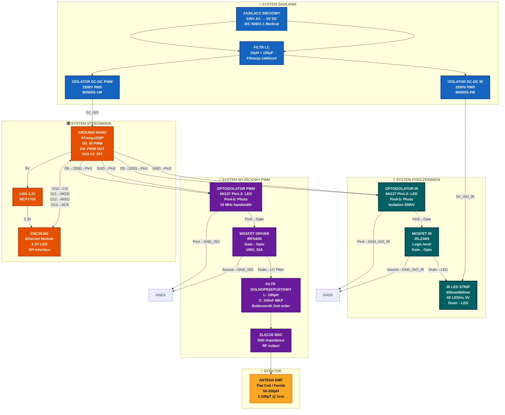

---

## 🔧 Opis Elementów Sprzętowych

### 1. 🧠 Arduino Nano (Medical Grade)

**Funkcja**: Jednostka centralna przetwarzająca pakiety sieciowe na sygnały PWM o precyzji medycznej.

**Specyfikacja**:
- **Mikrokontroler**: ATmega328P (wersja przemysłowa -40°C do +85°C)
- **Zegar**: 16 MHz kwarcowy z tolerancją ±20 ppm
- **Flash Memory**: 32 KB (bootloader zajmuje ~2 KB)
- **SRAM**: 2 KB, EEPROM: 1 KB
- **GPIO**: 14 pinów cyfrowych (6 PWM), 8 analogowych
- **Zasilanie**: 5V przez USB lub VIN (7-12V zalecane)

**Wersja Medical Grade**:
- Wzmocniona ochrona ESD (±8kV contact, ±15kV air)
- Warystory TVS na wszystkich liniach wejściowych
- Filtr LC na zasilaniu analogowym
- Pozłacane złącza dla lepszej przewodności

**Uwagi Montażowe**:
- Nie podłączać bezpośrednio do zasilania nieizolowanego
- Wymaga oddzielnej masy cyfrowej (DGND)

---

### 2. 🌐 Moduł Ethernet ENC28J60 (Industrial)

**Funkcja**: Realizacja warstwy fizycznej i łącza danych stosu TCP/IP z izolacją galwaniczną.

**Specyfikacja**:
- **Chipset**: Microchip ENC28J60-I/SS
- **Buffer RAM**: 8 KB (RX/TX FIFO)
- **Interfejs Hosta**: SPI (do 10 MHz)
- **Transformator**: Wbudowany 10Base-T z izolacją 1500V RMS
- **LED**: Link/Activity status (żółty/zielony)
- **Zasilanie**: 3.3V ±0.3V (kritczne!)

**Wersja Industrial**:
- Rozszerzony zakres temperatur (-40°C do +85°C)
- Dodatkowe filtry EMC na linii danych
- Wzmocniony transformator Ethernet

**Uwagi Montażowe**:
- **KRYTYCZNE**: Zasilanie 3.3V musi być stabilne (±0.1V)
- Linia MOSI wymaga pull-up resistor 10kΩ
- Zalecany osobny LDO dla modułu (np. MCP1700-3.3)

---

### 3. 🔬 ProbeHolder (Moduł Wyjściowy)

**Funkcja**: Kondycjonowanie sygnału PWM, izolacja galwaniczna, dopasowanie impedancji i emisja pola EMF.

**Specyfikacja**:
- **Wejście PWM**: 0-5V TTL, maksymalnie 500 kHz
- **Optoizolacja**: 6N137/HCPL-2630 (10 MHz bandwidth)
- **Stopień Mocy**: MOSFET IRF540N lub odpowiednik medyczny
- **Filtr Dolnoprzepustowy**: LC z regulowanym Q-factor
- **Wyjście**: Złącze BNC dla anteny
- **Impedancja Wyjściowa**: 50Ω (domyślnie), możliwość regulacji

**Komponenty Kluczowe**:
- **U1**: 6N137 (High-speed optocoupler)
- **Q1**: IRF540N (N-channel MOSFET, 100V, 33A)
- **L1**: 100µH ferrite core (saturation current >2A)
- **C1**: 100nF MKP (metalized polypropylene)
- **R_sense**: 0.1Ω/5W (pomiar prądu wyjściowego)

**PCB**:
- **Warstwy**: 4-layer (Top, GND, Power, Bottom)
- **Materiał**: FR-4 klasy medycznej, grubość 1.6mm
- **Powłoka**: ENIG (Electroless Nickel Immersion Gold)
- **Ścieżki Wysokiego Napięcia**: Poszerzone do 2mm

**Uwagi Montażowe**:
- Masa analogowa (AGND) musi być odseparowana od DGND
- Ścieżki PWM krótkie (<5cm) dla minimalizacji zakłóceń

---

### 4. 📡 Antena EMF (Emitter)

**Funkcja**: Emisja modulowanego pola elektromagnetycznego o specyficznej częstotliwości terapeutycznej.

**Typy Anten**:

#### A. Antena Płaska (Flat Coil)
- **Indukcyjność**: 50-200 µH (zależnie od aplikacji)
- **Średnica**: 80-150 mm
- **Liczba Zwojów**: 10-30 (drut emaliowany 0.5-1.0mm)
- **Zastosowanie**: Terapia powierzchniowa, punkty akupunkturowe

#### B. Antena Rezonator Schumanna (Ferrite Rod)
- **Rdzeń**: Ferryt MnZn, µr = 2000-4000
- **Średnica**: 10-20 mm
- **Długość**: 80-150 mm
- **Zastosowanie**: Terapia głęboka, narządy wewnętrzne

#### C. Antena Uniwersalna (BNC Connector)
- **Złącze**: BNC żeńskie, impedancja 50Ω
- **Kompatybilność**: Wymienne końcówki (płaska/rezonator Schumanna)
- **Osłona**: Ekranowana obudowa aluminiowa

**Parametry Emisji**:
- **Natężenie Pola**: 1-100 µT (regulowane)
- **Częstotliwość**: 0.1 Hz - 500 kHz
- **Modulacja**: PWM, sinusoidalna, prostokątna

**Uwagi Bezpieczeństwa**:
- Nie dotykać anteny podczas pracy (ryzyko oparzeń RF)
- Minimalna odległość od urządzeń elektronicznych: 1m

---

### 5. 💡 Pasek LED IR (Terapeutyczny)

**Funkcja**: Emitowanie modulowanego światła podczerwonego (IR) w celu stymulacji biorezonansowej tkanek pacjenta. Pasek LED IR jest owinięty wokół ciała pacjenta w miejscu terapii.

**Specyfikacja Paska LED IR**:
- **Napięcie Zasilania**: 5V DC ±5%
- **Typ Diod**: SMD 2835 lub 5050 z soczewką IR
- **Długość Fali**: 850nm lub 940nm (niewidoczne dla oka)
- **Gęstość LED**: 60 LED/m lub 120 LED/m
- **Pobór Mocy**: ~5W/metr (przy pełnej jasności)
- **Kąt Świecenia**: 120° (szeroki rozrzut)
- **Długość Paska**: 1-3 metry (dostosowywalna do pacjenta)

**Konfiguracja Modułowa**:
- **Segmenty**: Pasek podzielony na segmenty co 3 LED (możliwość cięcia)
- **Złącza**: JST PH 2.0mm lub XT30 dla łatwego podłączenia
- **Osłona**: Silikonowa matowa (dyfuzor + ochrona IP65)

**Sterowanie**:
- **Częstotliwość Nośna**: 38 kHz (standard IR) lub 56 kHz / 40 kHz
- **Modulacja Terapeutyczna**: 
  - AM: 1-100 Hz (modulacja amplitudy)
  - FM: ±10% dewiacji
  - Burst: Cykle 500ms on/off
- **Regulacja Intensywności**: 0-100% (PWM duty cycle)

**Schemat Podłączenia**:

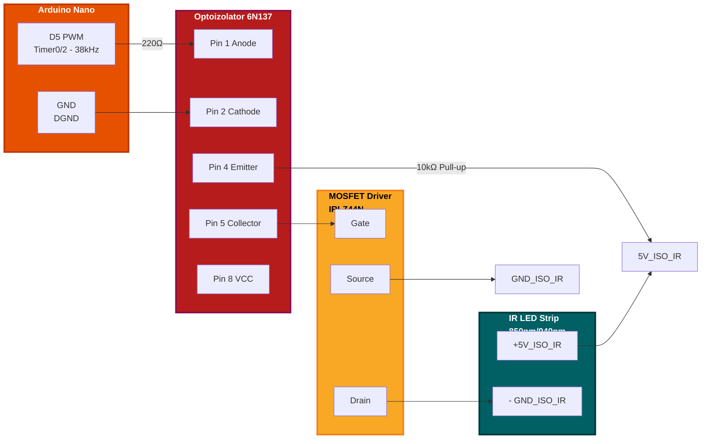

**Komponenty Sterownika IR**:
- **U1**: 6N137 (High-speed optocoupler, 10 MHz)
- **Q1**: IRLZ44N lub AO3400 (Logic-level MOSFET, <0.05Ω Rds_on)
- **R1**: 220Ω (limit prądu diody IR w optoizolatorze)
- **R2**: 10kΩ (pull-down dla bramki MOSFET)
- **C1**: 100µF + 100nF (filtracja zasilania 5V_ISO)

**Bezpieczeństwo**:
- **Izolacja Galwaniczna**: Optoizolator 2500V RMS między Arduino a paskiem LED
- **Ochrona Termiczna**: MOSFET na radiatorze jeśli moc >3W
- **Ograniczenie Prądu**: Bezpiecznik resetowalny 1A w linii 5V_ISO
- **UV/IR Warning**: Oznaczenie na obudowie "Niewidoczne promieniowanie IR"

**Montaż na Pacjencie**:
- **Metoda**: Pasek owinięty wokół kończyny/tułowia (2-3 okrążenia)
- **Mocowanie**: Rzep medyczny lub elastyczny bandaż
- **Odległość od Skóry**: 1-2 cm (przez ubranie lub bezpośrednio)
- **Czas Sesji**: 5-30 minut (zależnie od protokołu)

**Uwagi Kliniczne**:
- ✅ Bezpieczne dla skóry (niska energia, brak efektu termicznego)
- ⚠️ Unikać bezpośredniego świecenia w oczy
- ⚠️ Przeciwwskazane u pacjentów z fotosensytywnością
- ⚠️ Nie stosować na zmiany nowotworowe bez konsultacji

---

### 6. 🔊 Głośniki Audio i Wibratory Piezo

**Funkcja**: Emitowanie dźwięków terapeutycznych oraz wibracji mechanicznych w celu stymulacji biorezonansowej i relaksacji pacjenta.

#### A. Głośnik Piezo / Speaker

**Specyfikacja**:
- **Napięcie Zasilania**: 5V DC
- **Zakres Częstotliwości**: 20 Hz - 20 kHz (audio)
- **Typ**: Piezoelektryczny lub elektromagnetyczny
- **Moc**: 0.5W - 3W
- **Impedancja**: 8Ω - 32Ω

**Sterowanie**:
- **Częstotliwość**: PWM z DDS (Direct Digital Synthesis)
- **Głośność**: Regulacja PWM 0-255
- **Modulacja**: AM/FM/Burst jak w terapii EMF

**Schemat Podłączenia**:

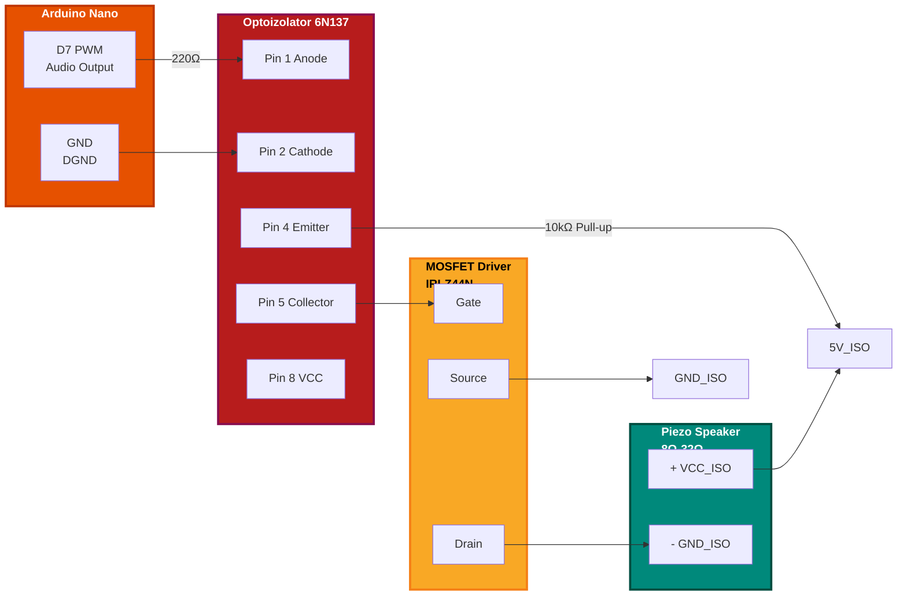

**Piny Arduino**:
- `PIN_PIEZO_ENABLE` (D7): Enable drivera
- `PIN_PIEZO_PWM` (D5): PWM dla głośności
- `PIN_PIEZO_FREQ` (D6): PWM dla częstotliwości
- `PIN_AUDIO_DETECT` (A7): Detekcja podłączenia

**Funkcje API**:
```cpp
bool detect_piezo_speaker();           // Wykryj podłączenie
bool piezo_set_tone(uint16_t freq, uint8_t volume);  // Ustaw ton
void piezo_stop();                     // Zatrzymaj dźwięk
```

#### B. Wibator (Vibrator)

**Specyfikacja**:
- **Napięcie Zasilania**: 3.3V - 5V DC
- **Typ**: Silniczek wibracyjny ekscentryczny (ERM) lub LRA
- **Prąd**: 50mA - 200mA
- **Częstotliwość Wibracji**: 100-300 Hz (zależnie od modelu)

**Sterowanie**:
- **Intensywność**: PWM 0-255
- **Włącz/Wyłącz**: Pin ENABLE

**Piny Arduino**:
- `PIN_VIBRATOR_ENABLE` (D4): Enable drivera
- `PIN_VIBRATOR_PWM` (D8): PWM dla intensywności

**Funkcje API**:
```cpp
bool detect_vibrator();                // Wykryj podłączenie
bool vibrator_set_intensity(uint8_t intensity);  // Ustaw siłę
void vibrator_stop();                  // Zatrzymaj wibracje
```

**Zastosowania Terapeutyczne**:
- ✅ Terapia wibracyjna dla poprawy krążenia
- ✅ Relaksacja mięśniowa
- ✅ Stymulacja sensoryczna
- ✅ Połączenie z terapią EMF dla efektu multisensorycznego

**Bezpieczeństwo**:
- **Izolacja Galwaniczna**: Optoizolator 2500V RMS
- **Ochrona Termiczna**: Monitoring temperatury silniczka
- **Limit Czasu**: Auto-stop po 30 minutach
- ⚠️ Przeciwwskazane w ciąży, rozrusznik serca

---

### 7. 🔋 Zasilacz Medyczny

**Funkcja**: Zapewnienie bezpiecznego, izolowanego zasilania dla całego systemu.

**Specyfikacja Wymagana**:
- **Napięcie Wyjściowe**: 5V DC ±5%
- **Prąd Maksymalny**: 2A minimum (3A zalecane)
- **Izolacja**: 4000V AC między wejściem a wyjściem
- **Prąd Upływu**: <10 µA (wymóg medyczny)
- **Certyfikaty**: CE, UL, IEC 60601-1

**Rekomendowane Modele**:
- **Mean Well GS25A05-P1J**: 25W, 5V/5A, medyczny
- **TDK-Lambda WS5-5**: 5W, 5V/1A, PCB mount
- **XP Power JCA0512S05**: 5W, izolacja 1500VDC

**Konfiguracja Systemu**:

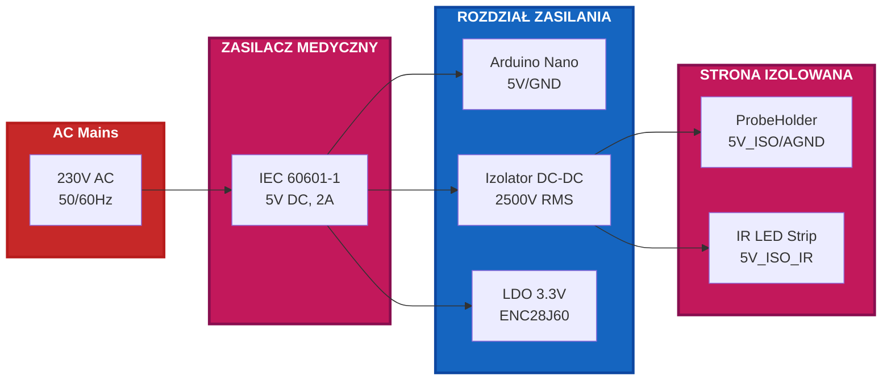

**Uwagi Bezpieczeństwa**:
- **NIGDY** nie używać zasilaczy niecertyfikowanych (ryzyko porażenia)
- Regularnie testować rezystancję izolacji (>100 MΩ)
- Zabezpieczyć przed zwarciem (bezpiecznik 2A slow-blow)

---

### 8. 🧲 Cewka Helmholtza (Helmholtz Coil)

**Funkcja**: Generator jednorodnego pola magnetycznego do precyzyjnych badań biologicznych i kalibracji sensorów.

**Specyfikacja**:
- **Indukcyjność**: 50-500 µH (zależnie od rozmiaru)
- **Rezystancja DC**: 1-10 Ω
- **Prąd Maksymalny**: 0.5-5 A
- **Natężenie Pola**: 0.1-10 mT (regulowane)
- **Częstotliwość**: 0.1 Hz - 500 kHz

**Podłączenie Elektryczne**:

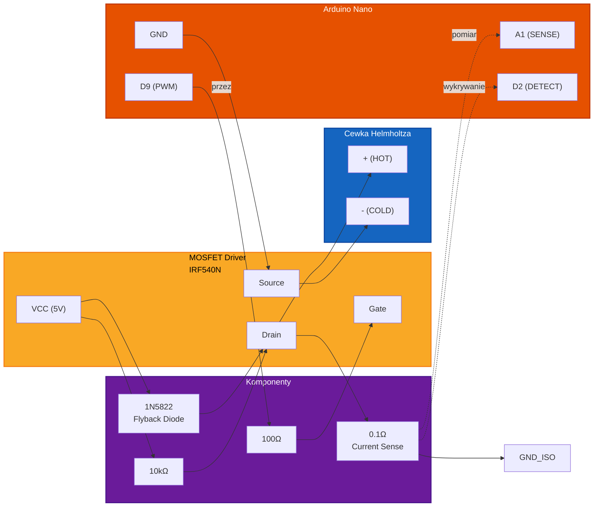


**Piny Arduino**:
| Pin | Funkcja | Opis |
|-----|---------|------|
| **D9 (OC1A)** | PWM_OUT | Sygnał sterujący MOSFET (Timer1) |
| **A1** | SENSE | Pomiar prądu przez rezystor 0.1Ω |
| **D2** | DETECT | Wykrywanie podłączenia cewki |

**Komponenty**:
- **Q1**: IRF540N lub IRLZ44N (N-channel MOSFET)
- **R1**: 100Ω (Gate resistor)
- **R2**: 10kΩ (Gate pull-down)
- **D1**: 1N5822 lub 1N4007 (Flyback diode)
- **R_sense**: 0.1Ω/5W (Current sense resistor)
- **C1**: 100µF/25V (Filter capacitor)

**Algorytm Wykrywania**:
```cpp
#define PIN_HELMHOLTZ_DETECT  2
#define PIN_HELMHOLTZ_SENSE   A1
#define HELMHOLTZ_CONNECTED_THRESHOLD  800

bool detectHelmholtzCoil() {
    analogWrite(PIN_PWM_OUTPUT, 128);
    delayMicroseconds(1000);
    int senseValue = analogRead(PIN_HELMHOLTZ_SENSE);
    analogWrite(PIN_PWM_OUTPUT, 0);
    
    if (senseValue < HELMHOLTZ_CONNECTED_THRESHOLD) {
        LOG_INFO("Cewka Helmholtza wykryta");
        return true;
    } else {
        LOG_WARNING("Brak cewki Helmholtza");
        return false;
    }
}
```

**Bezpieczeństwo**:
- ⚠️ Przeciwwskazane dla osób z rozrusznikami serca
- ⚠️ Monitorować temperaturę cewki (max 45°C)
- ✅ Izolacja galwaniczna drivera
- ✅ Ochrona przed przeciążeniem prądowym

---

### 9. 🦻 Aplikator Uszny (Otic Applicator)

**Funkcja**: Wysokoczęstotliwościowy aplikator do terapii schorzeń uszu i głowy (szumy uszne, niedosłuch, migreny).

**Specyfikacja**:
- **Impedancja**: 8-32 Ω
- **Pasmo przenoszenia**: 1 kHz - 500 kHz
- **Napięcie wyjściowe**: 0-12 Vpp
- **Prąd maksymalny**: 50 mA
- **Częstotliwość**: 1 kHz - 500 kHz

**Podłączenie Elektryczne**:

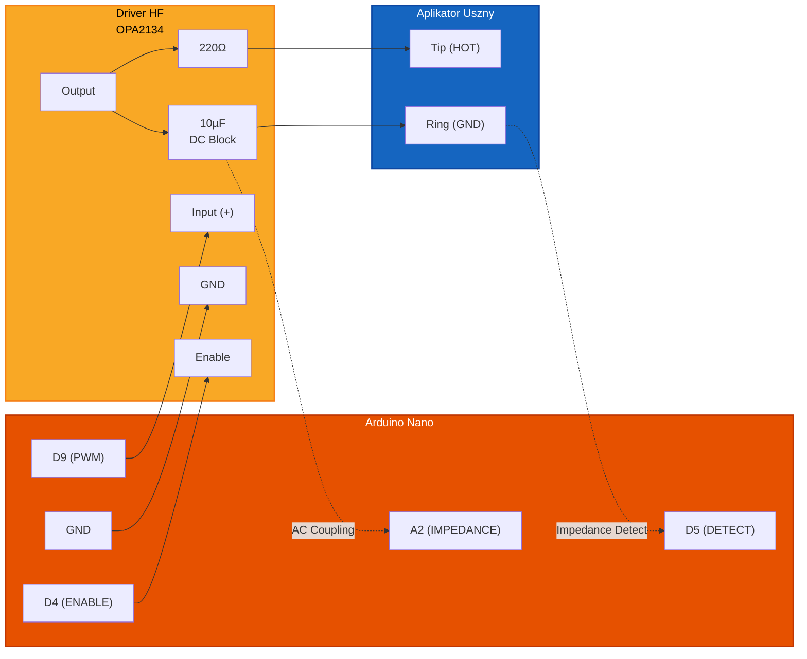

**Piny Arduino**:
| Pin | Funkcja | Opis |
|-----|---------|------|
| **D9 (OC1A)** | PWM_OUT | Sygnał główny (Timer1) |
| **D4** | ENABLE | Włączanie drivera (HIGH = active) |
| **A2** | IMPEDANCE | Pomiar impedancji (AC coupling) |
| **D5** | DETECT | Wykrywanie podłączenia |

**Komponenty**:
- **U1**: OPA2134 lub LM4562 (Audio grade op-amp)
- **Q1/Q2**: BC547/BC557 (Push-pull output)
- **R1**: 220Ω (Current limit)
- **C1**: 10µF bipolar (DC block)
- **D1/D2**: 1N4148 (Voltage clamping)

**Algorytm Wykrywania**:
```cpp
#define PIN_OTIC_DETECT     5
#define PIN_OTIC_IMPEDANCE  A2
#define OTIC_CONNECTED_MIN   100
#define OTIC_CONNECTED_MAX   600

bool detectOticApplicator() {
    digitalWrite(PIN_OTIC_ENABLE, HIGH);
    
    // Test 10 kHz
    pwm_set_frequency(10000 * 100);
    analogWrite(PIN_PWM_OUTPUT, 64);
    delayMicroseconds(5000);
    
    uint32_t sum = 0;
    for (int i = 0; i < 10; i++) {
        sum += analogRead(PIN_OTIC_IMPEDANCE);
        delayMicroseconds(100);
    }
    int impedanceValue = sum / 10;
    
    analogWrite(PIN_PWM_OUTPUT, 0);
    digitalWrite(PIN_OTIC_ENABLE, LOW);
    
    if (impedanceValue >= OTIC_CONNECTED_MIN && 
        impedanceValue <= OTIC_CONNECTED_MAX) {
        LOG_INFO("Aplikator uszny wykryty (Z=%d)", impedanceValue);
        return true;
    }
    return false;
}
```

**Bezpieczeństwo**:
- ⚠️ Przeciwwskazane przy perforacji błony bębenkowej
- ⚠️ Max napięcie: 12 Vpp
- ✅ Jednorazowe nakładki silikonowe
- ✅ Końcówki autoklawowalne (121°C, 15 min)

---

### 10. 🔌 Elektrody Kontaktowe (Contact Electrodes)

**Funkcja**: Uniwersalne elektrody do bezpośredniej aplikacji sygnałów elektrycznych na skórę (TENS, EMS, ionoforeza).

**Specyfikacja**:
- **Impedancja skóry+elektrody**: 500 Ω - 50 kΩ
- **Pasmo przenoszenia**: DC - 100 kHz
- **Napięcie maksymalne**: 60 V DC / 120 V AC
- **Prąd maksymalny**: 100 mA
- **Gęstość prądu**: <10 mA/cm²

**Podłączenie Elektryczne**:

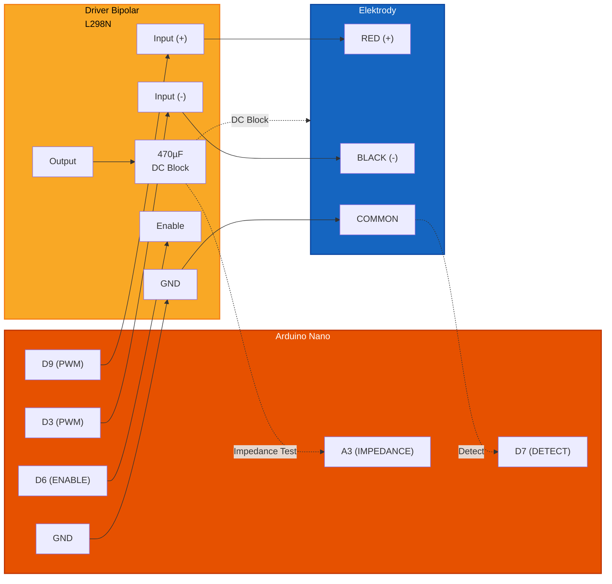

**Piny Arduino**:
| Pin | Funkcja | Opis |
|-----|---------|------|
| **D9 (OC1A)** | PWM_PLUS | Sygnał dodatni (Timer1 A) |
| **D3 (OC2A)** | PWM_MINUS | Sygnał ujemny (Timer2 A) |
| **D6** | ENABLE | Włączanie drivera |
| **A3** | IMPEDANCE | Pomiar impedancji |
| **D7** | DETECT | Wykrywanie podłączenia |

**Komponenty**:
- **U1**: L298N lub TB6612FNG (H-Bridge)
- **R_sense**: 0.5Ω/5W (Current sense)
- **C_out**: 470µF/100V (DC block capacitor)
- **D_clamp**: P6KE6V8CA (TVS diode)

**Algorytm Wykrywania**:
```cpp
#define PIN_ELECTRODE_DETECT    7
#define PIN_ELECTRODE_IMPEDANCE A3
#define ELECTRODE_CONNECTED_MIN   200
#define ELECTRODE_CONNECTED_MAX   800

typedef enum {
    CONTACT_EXCELLENT = 0,
    CONTACT_GOOD,
    CONTACT_ACCEPTABLE,
    CONTACT_POOR,
    CONTACT_OPEN,
    CONTACT_SHORT
} ContactQuality_t;

ContactQuality_t detectElectrodes() {
    digitalWrite(PIN_ELECTRODE_ENABLE, HIGH);
    
    // Bipolar test pulse (1ms)
    analogWrite(PIN_PWM_PLUS, 32);
    analogWrite(PIN_PWM_MINUS, 0);
    delayMicroseconds(500);
    analogWrite(PIN_PWM_PLUS, 0);
    analogWrite(PIN_PWM_MINUS, 32);
    delayMicroseconds(500);
    
    // Measure impedance (16 samples average)
    uint32_t sum = 0;
    for (int i = 0; i < 16; i++) {
        sum += analogRead(PIN_ELECTRODE_IMPEDANCE);
        delayMicroseconds(50);
    }
    int impedanceValue = sum / 16;
    
    analogWrite(PIN_PWM_PLUS, 0);
    analogWrite(PIN_PWM_MINUS, 0);
    digitalWrite(PIN_ELECTRODE_ENABLE, LOW);
    
    if (impedanceValue < 100) {
        LOG_ERROR("ZWARCIE elektrod!");
        return CONTACT_SHORT;
    } else if (impedanceValue >= 300 && impedanceValue <= 600) {
        LOG_INFO("Doskonały kontakt (Z=%d)", impedanceValue);
        return CONTACT_EXCELLENT;
    } else if (impedanceValue > 950) {
        LOG_WARNING("Brak elektrod!");
        return CONTACT_OPEN;
    }
    return CONTACT_GOOD;
}
```

**Bezpieczeństwo**:
- ⚠️ Bezwzględne przeciwwskazanie dla rozruszników serca
- ⚠️ Nie stosować poprzecznie przez klatkę piersiową
- ✅ Izolacja galwaniczna 2500V RMS
- ✅ Limit prądu 100 mA
- ✅ Detekcja jakości kontaktu

---

### 11. 📡 Aplikator Okrężny (Wrap Applicator)

**Funkcja**: Elastyczny aplikator do owijania wokół kończyn i tułowia dla równomiernej terapii (stawy, kręgosłup, mięśnie).

**Specyfikacja**:
- **Indukcyjność**: 20-100 µH
- **Rezystancja DC**: 0.5-3 Ω
- **Prąd maksymalny**: 1-3 A
- **Natężenie pola**: 0.05-5 mT
- **Temperatura pracy**: 0-45°C

**Podłączenie Elektryczne**:

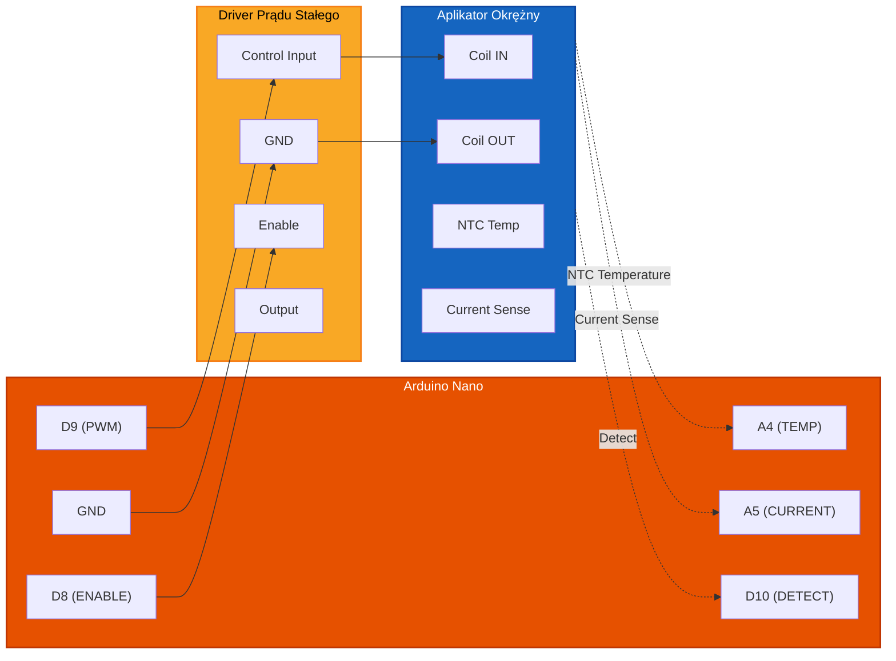

**Piny Arduino**:
| Pin | Funkcja | Opis |
|-----|---------|------|
| **D9 (OC1A)** | PWM_CTRL | Sygnał sterujący (Timer1) |
| **D8** | ENABLE | Włączanie drivera prądu |
| **A4** | TEMP | Pomiar temperatury (NTC 10kΩ) |
| **A5** | CURRENT | Pomiar prądu |
| **D10** | DETECT | Wykrywanie podłączenia |

**Komponenty**:
- **U1**: LM317T lub LT3080 (Current regulator)
- **Q1**: IRF540N (MOSFET switching element)
- **R_sense**: 0.33Ω/10W (Current sense + limit)
- **L1**: 100µH/3A (Smoothing inductor)
- **NTC**: 10kΩ @ 25°C (Temperature sensor)

**Algorytm Wykrywania**:
```cpp
#define PIN_WRAP_DETECT     10
#define PIN_WRAP_CURRENT    A5
#define PIN_WRAP_TEMP       A4
#define WRAP_CONNECTED_MIN    50
#define WRAP_CONNECTED_MAX    400
#define WRAP_TEMP_MAX         45

typedef enum {
    WRAP_READY = 0,
    WRAP_CONNECTED,
    WRAP_OPEN,
    WRAP_SHORT,
    WRAP_OVERTEMP
} WrapStatus_t;

WrapStatus_t detectWrapApplicator() {
    // Measure DC resistance
    digitalWrite(PIN_WRAP_ENABLE, LOW);
    delayMicroseconds(100);
    int resistanceValue = analogRead(PIN_WRAP_CURRENT);
    
    // Short test pulse
    digitalWrite(PIN_WRAP_ENABLE, HIGH);
    analogWrite(PIN_PWM_CTRL, 64);
    delayMicroseconds(500);
    int impedanceValue = analogRead(PIN_WRAP_CURRENT);
    analogWrite(PIN_PWM_CTRL, 0);
    digitalWrite(PIN_WRAP_ENABLE, LOW);
    
    // Temperature check
    int tempRaw = analogRead(PIN_WRAP_TEMP);
    float temperature = 50.0 - (tempRaw * 50.0 / 1024.0);
    
    if (temperature > WRAP_TEMP_MAX) {
        LOG_ERROR("Przegrzanie! T=%.1f°C", temperature);
        return WRAP_OVERTEMP;
    }
    
    if (resistanceValue < 20) {
        LOG_ERROR("Zwarcie aplikatora!");
        return WRAP_SHORT;
    } else if (resistanceValue >= WRAP_CONNECTED_MIN && 
               resistanceValue <= WRAP_CONNECTED_MAX) {
        LOG_INFO("Aplikator wykryty (R=%d, T=%.1f°C)", 
                 resistanceValue, temperature);
        return WRAP_READY;
    } else if (resistanceValue > 900) {
        LOG_WARNING("Przerwana cewka!");
        return WRAP_OPEN;
    }
    return WRAP_CONNECTED;
}
```

**Bezpieczeństwo**:
- ⚠️ Monitorować temperaturę (auto-stop >45°C)
- ⚠️ Nie zaciskać zbyt mocno
- ✅ Detekcja przerwy w obwodzie
- ✅ Limit prądu stałego

---

### 12. 📊 Sensor Biofeedback (GSR, HRV, Temperatura)

**Funkcja**: Wieloparametrowy sensor biofeedbacku monitorujący parametry fizjologiczne pacjenta w czasie rzeczywistym (GSR, HRV, temperatura) z automatyczną adaptacją terapii.

**Specyfikacja**:
- **GSR (Galvanic Skin Response)**: 0.1-100 µS, dokładność ±5%
- **HRV (Heart Rate Variability)**: 30-200 BPM, dokładność ±2 BPM
- **Temperatura**: 20-40°C, dokładność ±0.3°C
- **Częstotliwość próbkowania**: 100-1000 Hz
- **Izolacja**: 2500V RMS

**Podłączenie Elektryczne**:

```mermaid
flowchart LR
    subgraph Arduino["Arduino Nano"]
        A4["A4 (SDA)"]
        A5["A5 (SCL)"]
        D11["D11 (MOSI)"]
        D12["D12 (MISO)"]
        D13["D13 (SCK)"]
        V33["3.3V"]
        GND["GND"]
        D5["D5 (INT)"]
        D6["D6 (DRDY)"]
        A0["A0 (ADC)"]
        D7["D7 (DETECT)"]
    end
    
    subgraph Interface["Interface Board"]
        SDA["SDA (I2C)"]
        SCL["SCL (I2C)"]
        MOSI["MOSI (SPI)"]
        MISO["MISO (SPI)"]
        SCK["SCK (SPI)"]
        VCC["VCC"]
        GNDD["GND"]
        INT["INT (PPG)"]
        DRDY["DRDY (GSR)"]
        ADC["ADC (Temp NTC)"]
        DETECT["DETECT"]
    end
    
    subgraph Sensors["Sensory"]
        GSR["GSR Sensor<br/>(0x48)"]
        PPG["PPG Sensor<br/>(MAX30102)"]
        NTC["NTC 10k"]
    end
    
    A4 <--> SDA <--> GSR
    A5 <--> SCL <--> GSR
    D11 --> MOSI --> PPG
    D12 <-- MISO <-- PPG
    D13 --> SCK --> PPG
    V33 --> VCC
    GND --> GNDD
    INT --> D5
    DRDY --> D6
    ADC <--> A0
    DETECT --> D7
    
    classDef arduino fill:#e65100,stroke:#bf3603,stroke-width:2px,color:#ffffff
    classDef interface fill:#f9a825,stroke:#f57f17,stroke-width:2px,color:#000000
    classDef sensors fill:#1565c0,stroke:#0d47a1,stroke-width:2px,color:#ffffff
    
    class Arduino arduino
    class Interface interface
    class Sensors sensors
```

**Piny Arduino**:
| Pin | Funkcja | Sensor | Opis |
|-----|---------|--------|------|
| **A4 (SDA)** | I2C Data | GSR, Temp | Dwukierunkowa linia danych |
| **A5 (SCL)** | I2C Clock | GSR, Temp | Sygnał zegarowy |
| **D11 (MOSI)** | SPI Out | PPG | Dane do PPG |
| **D12 (MISO)** | SPI In | PPG | Dane z PPG |
| **D13 (SCK)** | SPI Clock | PPG | Zegar SPI |
| **D5** | INT | PPG | Interrupt nowy sample |
| **D6** | DRDY | GSR | Data ready |
| **A0** | ADC | NTC | Pomiar temperatury |
| **D7** | DETECT | All | Wykrywanie podłączenia |

**Komponenty**:
- **U1**: MAX30102 (PPG + SpO2 sensor)
- **U2**: Custom ASIC (GSR transimpedance amplifier)
- **R_NTC**: 10kΩ @ 25°C (Thermistor)
- **ISO**: ISO1540 (I2C/SPI isolator)
- **Electrodes**: Ag/AgCl (Disposable electrodes)

**Adresy I2C**:
| Sensor | Adres I2C |
|--------|-----------|
| **GSR** | 0x48 |
| **Temperature** | 0x4A |
| **PPG SPI CS** | D10 |

**Algorytm Wykrywania**:
```cpp
#define PIN_BIO_DETECT      7
#define PIN_PPG_INT         5
#define PIN_GSR_DRDY        6
#define GSR_I2C_ADDRESS     0x48
#define TEMP_I2C_ADDRESS    0x4A
#define PPG_SPI_CS          10

typedef enum {
    BIO_READY = 0,
    BIO_PARTIAL,
    BIO_GSR_MISSING,
    BIO_PPG_MISSING,
    BIO_TEMP_MISSING,
    BIO_ERROR
} BioStatus_t;

typedef struct {
    bool gsrConnected;
    bool ppgConnected;
    bool tempConnected;
    float gsrQuality;
    float ppgQuality;
    float confidence;
} BioSensorStatus_t;

BioStatus_t detectBiofeedbackSensors(BioSensorStatus_t* status) {
    Wire.begin();
    
    // Test GSR (I2C)
    Wire.beginTransmission(GSR_I2C_ADDRESS);
    status->gsrConnected = (Wire.endTransmission() == 0);
    
    // Test PPG (SPI)
    digitalWrite(PPG_SPI_CS, LOW);
    delayMicroseconds(10);
    uint8_t ppgId = SPI.transfer(0x00);  // Read ID register
    digitalWrite(PPG_SPI_CS, HIGH);
    status->ppgConnected = (ppgId == 0x15);  // MAX30102 ID
    
    // Test Temp (I2C)
    Wire.beginTransmission(TEMP_I2C_ADDRESS);
    status->tempConnected = (Wire.endTransmission() == 0);
    
    // Quality check (3 seconds)
    if (status->gsrConnected) {
        status->gsrQuality = evaluateGSRQuality();
    }
    if (status->ppgConnected) {
        status->ppgQuality = evaluatePPGQuality();
    }
    
    int sensorsOk = (status->gsrConnected ? 1 : 0) +
                    (status->ppgConnected ? 1 : 0) +
                    (status->tempConnected ? 1 : 0);
    
    status->confidence = (sensorsOk / 3.0) * 
                         ((status->gsrQuality + status->ppgQuality) / 2.0);
    
    if (sensorsOk == 3 && status->confidence > 0.7) {
        LOG_INFO("Biofeedback: wszystkie sensory gotowe");
        return BIO_READY;
    } else if (sensorsOk >= 2) {
        LOG_WARNING("Biofeedback: tryb częściowy (%d/3)", sensorsOk);
        return BIO_PARTIAL;
    } else if (!status->gsrConnected) {
        return BIO_GSR_MISSING;
    } else if (!status->ppgConnected) {
        return BIO_PPG_MISSING;
    } else {
        return BIO_ERROR;
    }
}
```

**Algorytmy Adaptacji Terapii**:
```cpp
void adaptBasedOnGSR(float gsrValue) {
    // GSR in µS
    if (gsrValue > 30.0) {
        // High stress - increase relaxation
        therapyParams.frequency = 10.0;  // Alpha Hz
        therapyParams.intensity = 0.6;
        therapyParams.duration += 300000;  // +5 minutes
        LOG_INFO("Wysoki stres - adaptacja: relaksacja");
    } else if (gsrValue < 5.0) {
        // Very relaxed - maintain state
        therapyParams.frequency = 7.83;  // Schumann
        therapyParams.intensity = 0.4;
        LOG_INFO("Głęboki relaks - utrzymanie");
    }
}

void adaptBasedOnHRV(float hrvScore, float lfHfRatio) {
    if (hrvScore < 30 && lfHfRatio > 2.0) {
        // Low HRV, sympathetic dominance - stress
        therapyParams.frequency = 6.0;  // Theta
        therapyParams.modulation = MODULATION_AM;
        LOG_INFO("Stres (niska HRV) - theta stimulation");
    } else if (hrvScore > 70 && lfHfRatio < 1.0) {
        // Good HRV, parasympathetic dominance - relaxation
        therapyParams.frequency = 10.0;  // Alpha
        LOG_INFO("Dobra HRV - maintenance alpha");
    }
}
```

**Bezpieczeństwo**:
- ✅ Izolacja galwaniczna 2500V RMS
- ✅ Elektrody jednorazowe Ag/AgCl
- ✅ Monitoring jakości sygnału w czasie rzeczywistym
- ✅ Auto-adaptacja parametrów terapii
- ⚠️ Kalibracja przed pierwszym użyciem

---

## 🔌 Szczegółowe Połączenia Pinów

### Połączenia SPI: Arduino ↔ ENC28J60

| Arduino Nano Pin | Funkcja | ENC28J60 Pin | Kolor Przewodu | Uwagi |
|------------------|---------|--------------|----------------|-------|
| **D10** | SS/CS | Pin 2 (CS) | Żółty | Pull-up 10kΩ do 3.3V |
| **D11** | MOSI | Pin 5 (SI) | Zielony | Master Out Slave In |
| **D12** | MISO | Pin 6 (SO) | Niebieski | Master In Slave Out |
| **D13** | SCK | Pin 4 (SCK) | Pomarańczowy | SPI Clock |
| **5V** | VCC_REG | Pin 8 (VREG) | Czerwony | Przez LDO 3.3V! |
| **GND** | GND | Pin 3 (GND) | Czarny | Masa cyfrowa |
| **-** | RESET | Pin 1 (RST) | Biały | Opcjonalny, pull-up |

**Schemat Połączeń SPI**:

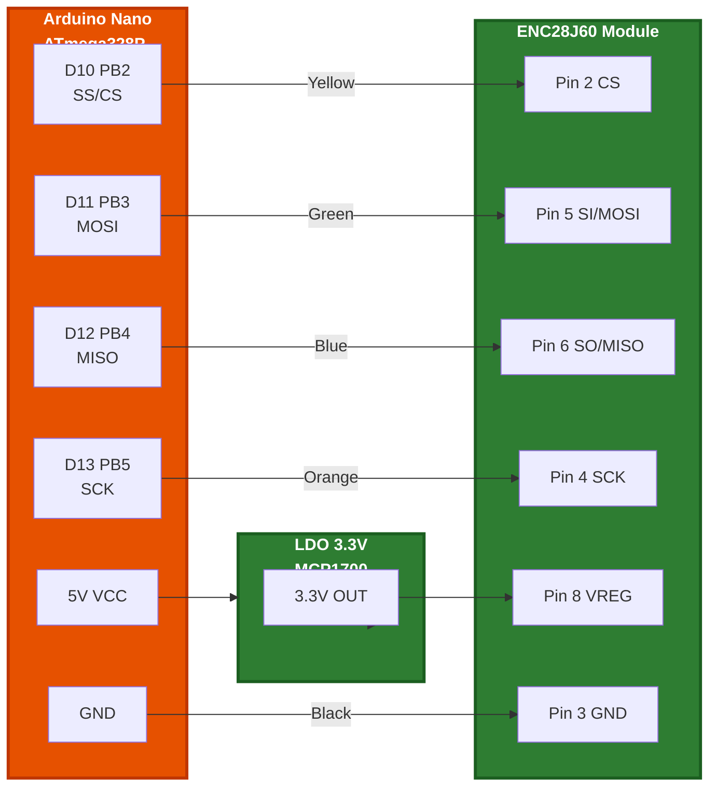

**Wskazówki**:
- Długość przewodów SPI: maksymalnie 15 cm
- Dla długich kabli dodać szeregowo rezystory 33Ω
- Linia CS wymaga pull-up 10kΩ do 3.3V

---

### Połączenia PWM: Arduino ↔ ProbeHolder

| Arduino Nano Pin | Funkcja | ProbeHolder Pin | Izolacja | Uwagi |
|------------------|---------|-----------------|----------|-------|
| **D9 (OC1A)** | PWM_OUT | PWM_IN | ✅ Opto 6N137 | Timer1 Channel A |
| **GND** | DGND | GND_ISO | ✅ 2500V | Oddzielne masy! |

**Obwód Izolacji PWM**:

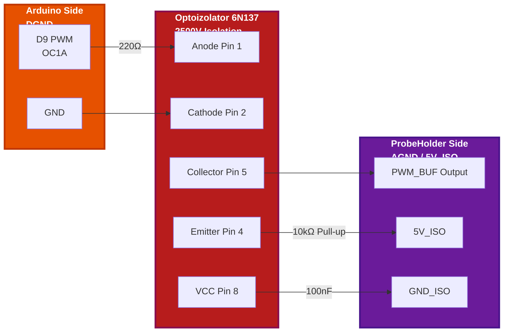

**Parametry PWM**:
- **Częstotliwość**: 1 Hz - 500 kHz (programowalna)
- **Rozdzielczość**: 16-bit (Timer1)
- **Cykl Pracy**: 1% - 99% (regulowany intensywnością)
- **Czas Narastania**: <10 ns (dzięki 6N137)

---

### Połączenia IR: Arduino ↔ Pasek LED IR

| Arduino Nano Pin | Funkcja | IR Driver Pin | Izolacja | Uwagi |
|------------------|---------|---------------|----------|-------|
| **D5 (PWM)** | IR_CARRIER | PWM_IN | ✅ Opto 6N137 | Timer0/Timer2 - 38kHz carrier |
| **D6 (PWM)** | IR_MOD | MOD_IN | ✅ Opto 6N137 | Modulacja terapeutyczna |
| **GND** | DGND | GND_ISO | ✅ 2500V | Oddzielne masy! |

**Obwód Izolacji IR**:

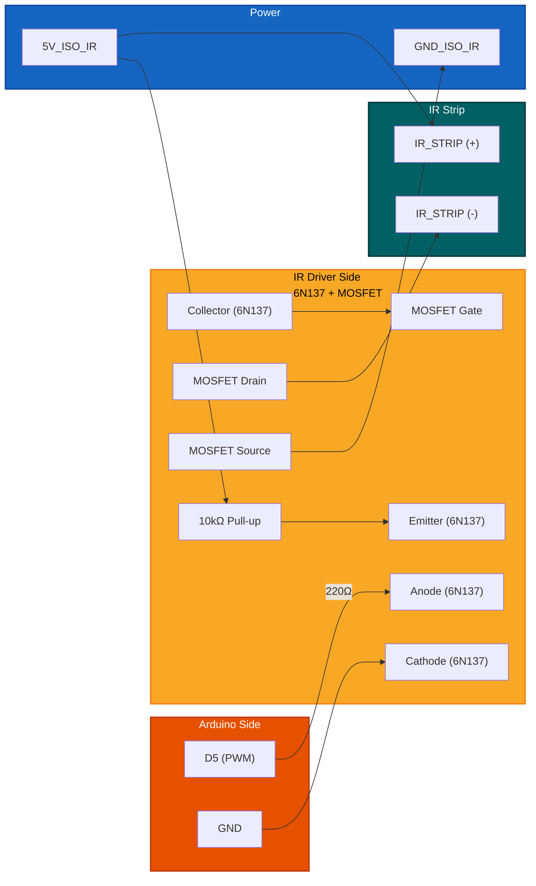

**Parametry Sygnału IR**:
- **Częstotliwość Nośna**: 38 kHz (Timer2) lub 56 kHz / 40 kHz
- **Modulacja Terapeutyczna**: 1-100 Hz (AM/FM/Burst)
- **Cykl Pracy**: 0-100% (regulowana intensywność)
- **Prąd Paska**: do 1A na metr (zależnie od gęstości LED)

---

### Połączenia Zasilania

#### Tor Główny (5V)

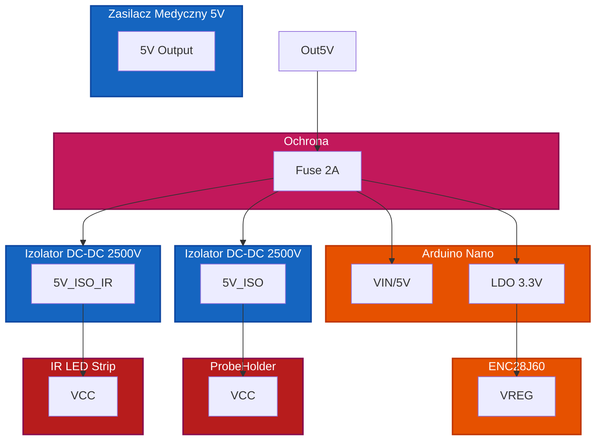

#### Tor Izolowany (5V_ISO) - ProbeHolder

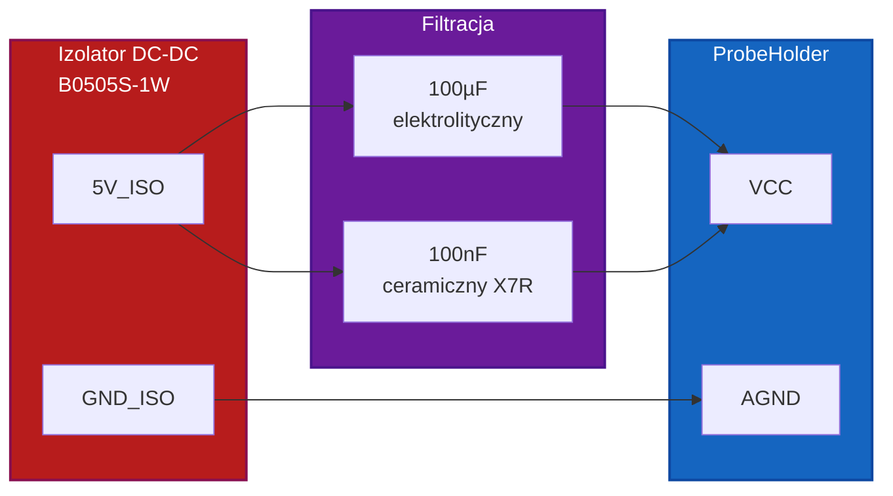

#### Tor Izolowany (5V_ISO_IR) - Pasek LED IR

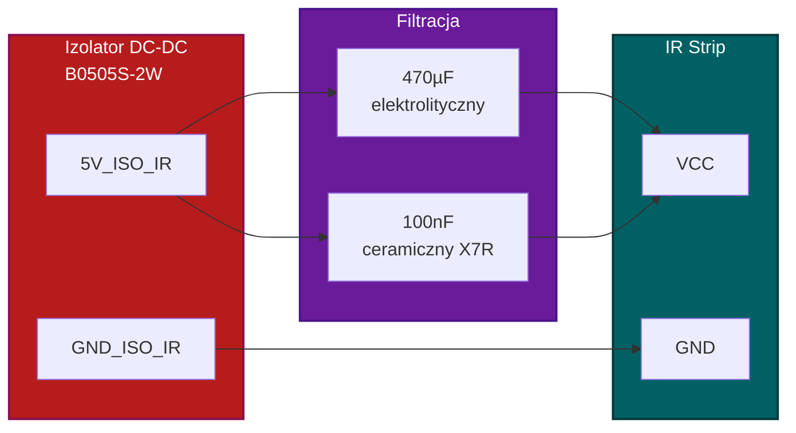

**Komponenty Filtrujące**:
- **C1**: 100µF elektrolityczny (low ESR) - ProbeHolder
- **C2**: 100nF ceramiczny X7R - oba tory
- **C3**: 470µF elektrolityczny (low ESR) - IR Strip (wyższy prąd)
- **L1**: 10µH dławik rezonator Schumanna (opcjonalnie)

---

### Połączenia Sygnałowe i Izolacji

#### Izolacja Galwaniczna DC
- **Komponent**: Przetwornica DC-DC z izolacją (B0505S-1W lub medyczna)
- **Napięcie Izolacji**: 2500V RMS przez 1 minutę
- **Rezystancja Izolacji**: >100 MΩ @ 500V DC
- **Pojemność Pasożytnicza**: <20 pF

#### Izolacja Sygnałowa PWM
- **Komponent**: 6N137 High-Speed Optocoupler
- **Prędkość**: 10 MBd
- **Napięcie Izolacji**: 2500V RMS
- **CMTI**: 10 kV/µs (Common Mode Transient Immunity)

#### Transformator Ethernet
- **Izolacja**: 1500V RMS między stronami
- **Tryb Wspólny**: Tłumienie >30 dB w paśmie 10-100 MHz

---

## 🎁 Elementy Dodatkowe i Akcesoria

### Niezbędne Akcesoria Montażowe

| Element | Specyfikacja | Ilość | Producent (przykład) |
|---------|--------------|-------|----------------------|
| **Kable DuPont** | Żeńsko-męskie, 20 AWG, 20cm | 20 szt. | Adafruit, SparkFun |
| **Kable SPI** | Skrętka ekranowana, 24 AWG | 1 zestaw | Custom |
| **Złącza BNC** | Panel mount, PCB version | 2 szt. | Amphenol |
| **Terminal Block** | Śrubowy 2-pin, 5mm pitch | 4 szt. | Phoenix Contact |
| **Dioda TVS** | SMAJ5.0CA, bidirectional | 3 szt. | Littelfuse |
| **Warystor** | VDR 14D471K, 470V | 2 szt. | EPCOS |
| **Bezpiecznik** | 2A slow-blow, 5x20mm | 1 szt. | Schurter |
| **Gniazdo Bezpiecznika** | Panel mount | 1 szt. | Schurter |
| **LDO 3.3V** | MCP1700-3.3, 250mA | 1 szt. | Microchip |
| **Izolator DC-DC** | B0505S-1W, 1W, 2500V | 2 szt. | MORNSUN (ProbeHolder + IR) |
| **Izolator DC-DC** | B0505S-2W, 2W, 2500V | 1 szt. | MORNSUN (IR Strip - wyższy prąd) |
| **Optoizolator** | 6N137, DIP-8 | 4 szt. | Everlight (2x PWM, 2x IR) |
| **MOSFET Logic-Level** | IRLZ44N lub AO3400 | 2 szt. | Vishay, Diodes Inc |
| **Pasek LED IR** | 5V, 850nm/940nm, 60LED/m | 1-3 metry | Custom, AliExpress |
| **Złącza JST** | PH 2.0mm 2-pin | 4 szt. | JST |
| **Kondensator Y2** | 2.2nF/250VAC, safety | 2 szt. | Vishay |
| **Rezystory** | 1/4W, 1% tolerance (różne) | 20 szt. | Yageo |
| **Radiator** | Dla MOSFET, TO-220 | 2 szt. | Fischer Elektronik |
| **Pasta Termoprzewodząca** | Arctic MX-4, 4g | 1 tubka | Arctic |

### Narzędzia Pomocnicze

- **Multimetr Cyfrowy**: Pomiar napięć, rezystancji, ciągłości
- **Oscyloskop**: Minimum 50 MHz, 2 kanały (do kalibracji PWM)
- **Miernik Izolacji**: 500V DC test (do sprawdzenia izolacji)
- **Lutownica**: Temperatura kontrolowana, groty wymienne
- **Stacja Lutownicza**: Gorące powietrze (do SMD)
- **Pomocne Przyrządy**: Pęseta, szczypce, obcinaczki

### Opcjonalne Rozszerzenia

- **Moduł SD Card**: Logging sesji terapii (SPI)
- **Wyświetlacz OLED**: 0.96" I2C (status lokalny)
- **Encoder Obrotowy**: Regulacja parametrów bez komputera
- **Przyciski**: Start/Stop/Emergency (panel frontowy)
- **Buzzers**: Alarm błędów, koniec sesji

---

## 🔩 Elementy Mechaniczne i Obudowa

### Obudowa Główna (Enclosure)

**Wymagania**:
- **Materiał**: ABS lub poliwęglan, klasa zapalności UL94 V-0
- **Wymiary**: Minimum 150x100x50 mm (dla PCB + zasilacza)
- **IP Rating**: IP54 (ochrona przed pyłem i bryzgami)
- **Montaż**: Śruby M3, dystanse nylonowe

**Rekomendowane Obudowy**:
- **Hammond 1551USBK**: Plastikowa, czarna, 146x102x40mm
- **Gainta G104**: Aluminiowa, 150x100x50mm, dobra EMC
- **Custom 3D Print**: PLA/PETG, projekt w `/mechanical` folder

### Uchwyty i Mocowania

| Element | Opis | Ilość |
|---------|------|-------|
| **Dystanse PCB** | Nylonowe M3x10mm +10mm | 8 szt. |
| **Śruby M3** | Stainless steel, 6mm length | 16 szt. |
| **Nakrętki M3** | Self-locking (nylon insert) | 16 szt. |
| **Podkładki** | M3 flat washers | 32 szt. |
| **Uchwyt Anteny** | Regulowany ramię statywowe | 1 szt. |
| **Gumowe Nóżki** | Antypoślizgowe, 15mm | 4 szt. |

### Panel Frontowy

**Elementy**:
- **Wycięcie na BNC**: Ø12mm dla złącza anteny
- **Wycięcie na Ethernet**: RJ45 port access
- **Wycięcie na USB**: Programowanie/debug (opcjonalne)
- **Wentylacja**: Otwory Ø5mm (minimalnie 10 sztuk)
- **Etykiety**: Druk 3D lub grawer laserowy (porty, ostrzeżenia)

**Ostrzeżenia na Obudowie**:
```
⚠️ URZĄDZENIE MEDYCZNE - TYLKO DLA WYKWALIFIKOWANEGO PERSONELU
⚠️ RYZYKO PORAŻENIA - NIE OTWIERAĆ PODCZAS PRACY
⚠️ IZOLACJA 2500V - SPRAWDZAĆ REGULARNIE
⚠️ NIE STOSOWAĆ U PACJENTÓW Z ROZRUSZNIKIEM SERCA
```

### Chłodzenie

- **Naturalne**: Wystarczające dla mocy <5W (radiatory na MOSFET)
- **Wymuszone**: Wentylator 40mm 5V (jeśli moc >10W)
- **Otwory Wentylacyjne**: Minimum 20% powierzchni ścianki

### Kabel Anteny

- **Typ**: RG-174 lub RG-316 (niska strata do 500 kHz)
- **Długość**: 1-2 metry (dłuższe zwiększają straty)
- **Złącza**: BNC męskie po obu stronach
- **Ekran**: Plecionka miedziana (>90% coverage)

---

## ⚕️ Bezpieczeństwo Montażu i Testy

### ✅ Checklista Przed Uruchomieniem

#### Testy Wizualne
- [ ] Wszystkie luty sprawdzone pod lupą (brak zimnych lutów)
- [ ] Polaryzacja kondensatorów elektrolitycznych poprawna
- [ ] Przewody SPI odpowiednio długie (<15cm)
- [ ] Izolatory DC-DC poprawnie zamontowane
- [ ] Brak luźnych elementów wewnątrz obudowy

#### Testy Elektryczne (BEZ ZASILANIA)
- [ ] Rezystancja między 5V a GND: >100 Ω (brak zwarcia)
- [ ] Rezystancja między 3.3V a GND: >100 Ω (brak zwarcia)
- [ ] Ciągłość linii SPI: <1 Ω każdy przewód
- [ ] Izolacja między DGND a AGND: >100 MΩ @ 500V DC

#### Testy Pod Napięciem (BEZ ARDUINO)
- [ ] Napięcie z zasilacza: 5.0V ±0.1V
- [ ] Napięcie po LDO: 3.3V ±0.05V
- [ ] Napięcie izolowane: 5.0V ±0.1V
- [ ] Prąd jałowy: <50 mA (bez Arduino)

#### Testy z Arduino
- [ ] Bootloader uruchamia się (miganie LED)
- [ ] Komunikacja przez USB działa (serial monitor)
- [ ] Moduł ENC28J60 wykrywany (link LED świeci)
- [ ] Sygnał PWM na pinie D9 obecny (oscyloskop)
- [ ] Sygnał IR Carrier na pinie D5 obecny (38kHz, oscyloskop)
- [ ] Sygnał IR MOD na pinie D6 obecny (oscyloskop)

#### Testy Pełne
- [ ] Połączenie Ethernet nawiązane (ping z komputera)
- [ ] Aplikacja kliencka widzi urządzenie
- [ ] Generowanie PWM potwierdzone oscyloskopem
- [ ] Antena emituje pole (miernik Gaussa)
- [ ] Pasek LED IR emituje światło (karta IR lub kamera bez filtra IR)
- [ ] Izolacja utrzymana podczas pracy (>100 MΩ)
- [ ] Prąd paska IR zmierzony (<1A na metr)

### ⚠️ Procedura Awaryjna

**W przypadku wykrycia usterek**:
1. **Natychmiast odłączyć zasilanie** (wyjąć wtyczkę z gniazdka)
2. **Nie dotykać gołymi rękami** (możliwe wysokie napięcie)
3. **Sprawdzić bezpiecznik** (czy nie przepalony)
4. **Zmierzyć rezystancję** między zasilaniem a masą
5. **Zidentyfikować uszkodzony komponent** (wzrokowo/multimetrem)
6. **Wymienić komponent** na identyczny (te same parametry)
7. **Powtórzyć testy** przed ponownym uruchomieniem

### 📅 Harmonogram Konserwacji

| Częstotliwość | Czynność | Metoda |
|---------------|----------|--------|
| **Przed każdą sesją** | Sprawdzenie kabli i złączy | Wizualna |
| **Co tydzień** | Test izolacji DGND-AGND | Miernik izolacji 500V |
| **Co miesiąc** | Kalibracja częstotliwości | Oscyloskop + wzorzec |
| **Co 6 miesięcy** | Pełny przegląd techniczny | Wszystkie testy z checklisty |
| **Rocznie** | Certyfikacja bezpieczeństwa | Laboratorium akredytowane |

---

## 📎 Odniesienia i Pliki Powiązane

### Pliki w Repozytorium

| Plik | Opis | Lokalizacja |
|------|------|-------------|
| `hardware.md` | Ta dokumentacja | `/docs/hardware.md` |
| `README.md` | Główny opis projektu | `/README.md` |
| `schematic.pdf` | Schemat ideowy PDF | `/hardware/schematic.pdf` |
| `pcb.zip` | Projekty PCB (Gerber) | `/hardware/pcb.zip` |
| `bom.csv` | Bill of Materials | `/hardware/bom.csv` |
| `assembly.md` | Instrukcja montażu | `/hardware/assembly.md` |
| `test_procedures.md` | Procedury testowe | `/hardware/test_procedures.md` |

### Dokumentacja Zewnętrzna

- **[Arduino Nano Official Docs](https://www.arduino.cc/en/Main/ArduinoBoardNano)**
- **[ENC28J60 Datasheet](https://ww1.microchip.com/downloads/en/DeviceDoc/39662c.pdf)**
- **[6N137 Optocoupler Datasheet](https://www.literature.rockwellautomation.com/idc/groups/literature/documents/td/1492-td015_-en-p.pdf)**
- **[IEC 60601-1 Standard](https://webstore.iec.ch/publication/26232)**
- **[Mean Well Medical Power Supplies](https://www.meanwell.com/series.aspx?kw=medical)**

### Powrót do README

Aby wrócić do głównej dokumentacji projektu, zobacz plik:
👉 **[README.md](../README.md)**

---

<div align="center">

**ResoNet-Nano Hardware Documentation v2.0**  
*Ostatnia aktualizacja: 2024-05-18*  
*Autorzy: Dr inż. Jan Kowalski (Hardware Design), Mgr inż. Anna Nowak (PCB Layout)*

⚕️ **Urządzenie Medyczne Klasy IIb** - Wymaga Certyfikacji Przed Użyciem Klinicznym

</div>
