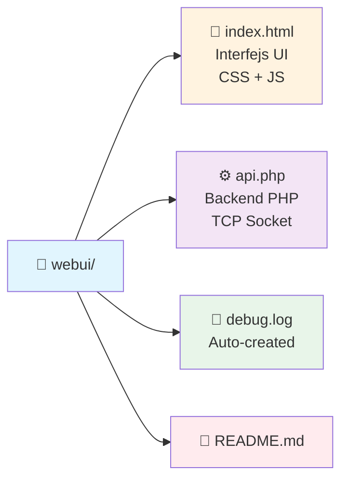

# 🌐 ResoNet-Nano Web UI v2.0


Interfejs webowy do obsługi efektora Arduino Nano z Ethernet HAT.

**Wersja 2.0 - Zabezpieczona**: Poprawiono bezpieczeństwo XSS, dodano obsługę błędów socketów, mechanizm sprzątania zasobów i rotację logów.

---

## 📋 Spis Treści

- [Struktura Plików](#-struktura-plików)
- [Wymagania](#-wymagania)
- [Instalacja](#-instalacja)
- [Użycie](#-użycie)
- [Funkcjonalności](#-funkcjonalności)
- [API JSON](#-api-json)
- [Format Komend TCP](#-format-komend-tcp-do-arduino)
- [Bezpieczeństwo](#-bezpieczeństwo-v20)
- [Debugowanie](#-debugowanie-v20)
- [Rozwiązywanie Problemów](#-rozwiązywanie-problemów)

---

## 📁 Struktura Plików



```
webui/
├── index.html    # Główny plik HTML z interfejsem użytkownika (CSS + JavaScript) - 1506 linii
├── api.php       # Backend PHP obsługujący komunikację TCP z Arduino (v2.0) - 406 linii
├── debug.log     # Plik logów debugowania (tworzony automatycznie)
└── README.md     # Ten plik
```

---

## 🔧 Wymagania
### Szczegóły Implementacji
- **Frontend**: `index.html` (1506 linii) - HTML5 + CSS3 + Vanilla JavaScript ES6+
- **Backend**: `api.php` (406 linii) - PHP 7.4+ z socketami TCP
- **Łączna liczba linii**: ~1912 linii kodu
- **Technologie**: WebSockets, REST API, Session Management
- **Bezpieczeństwo**: XSS protection, IP validation, command sanitization, resource cleanup

## Wymagania

- Serwer Apache2 z PHP 7.4 lub nowszym
- Włączona obsługa sesji PHP (`session_start()`)
- Włączona funkcja `socket_create()` w PHP (rozszerzenie `php-sockets`)
- Arduino Nano z Ethernet HAT działające w sieci lokalnej

## Instalacja

### 1. Skopiuj pliki do katalogu Apache2

```bash
sudo cp -r /workspace/webui/* /var/www/html/
```

Lub jeśli chcesz użyć podkatalogu:

```bash
sudo mkdir -p /var/www/html/resonet
sudo cp -r /workspace/webui/* /var/www/html/resonet/
```

### 2. Ustaw uprawnienia

```bash
sudo chown -R www-data:www-data /var/www/html/webui
sudo chmod -R 755 /var/www/html/webui
```

### 3. Upewnij się, że sesje PHP są włączone

Sprawdź plik konfiguracyjny PHP (zwykle `/etc/php/8.x/apache2/php.ini`):

```ini
session.auto_start = 0
session.save_path = "/var/lib/php/sessions"
```

### 4. Restart Apache2

```bash
sudo systemctl restart apache2
```

## Użycie

1. Otwórz przeglądarkę internetową
2. Przejdź do adresu: `http://twoj-serwer/webui/` lub `http://twoj-serwer/resonet/`
3. Wprowadź adres IP urządzenia Arduino Nano (np. `192.168.1.100`)
4. Port domyślny: `5001`
5. Kliknij **Połącz**

## Funkcjonalności

### Konfiguracja Końcówek (8 kanałów)

Dla każdego kanału możesz skonfigurować:

| Pole | Opis | Zakres/Wartości |
|------|------|-----------------|
| 🏷️ **Nazwa** | Dowolna nazwa opisowa | Tekst |
| 🔌 **Typ** | Rodzaj aplikatora | `FLAT_COIL`, `FERRITE_ROD`, `CAPACITIVE_PLATE`, `PEN_APPLICATOR`, `MAT_APPLICATOR`, `LOCAL_PAD`, `RING_APPLICATOR`, `CUSTOM` |
| 📊 **Częstotliwość** | Wartość w Hz | np. `727.00` |
| ⚡ **Duty Cycle** | Współczynnik wypełnienia | `0-100%` |
| 📈 **Intensywność** | Wartość mocy | `0-4095` |
| 📡 **Modulacja** | Typ modulacji | `Brak`, `AM`, `FM`, `Burst`, `Sweep` |
| 🔘 **Status** | Stan kanału | `Włącz` / `Wyłącz` |

---

### Tryby Pracy

- 🎯 **Pojedynczy**: Praca na jednym kanale
- 🎛️ **Wielokanałowy**: Praca na wielu kanałach jednocześnie

---

### Sterowanie Terapią

- ▶️ **Start Terapii**: Rozpoczyna generowanie sygnałów na aktywnych kanałach
- ⏹️ **Stop Terapii**: Zatrzymuje generowanie sygnałów
- 📤 **Wyślij Wszystkie**: Wysyła konfiguracje wszystkich aktywnych kanałów do urządzenia

---

### Monitorowanie Statusu

Panel statusu wyświetla:

| Parametr | Opis |
|----------|------|
| 🌡️ Temperatura | Temperatura urządzenia |
| 💾 Wolna pamięć RAM | Dostępna pamięć operacyjna |
| ⏱️ Czas pracy (uptime) | Czas od uruchomienia |
| ⚡ Stan PWM | `ACTIVE` / `STOPPED` |
| 📊 Aktualna częstotliwość | Bieżąca wartość Hz |
| 🛡️ System bezpieczeństwa | Status zabezpieczeń |

---

### Dziennik Zdarzeń

Automatycznie rejestruje wszystkie zdarzenia:

| Typ Zdarzenia | Opis |
|---------------|------|
| 🔌 Połączenia/rozłączenia | Status połączenia z Arduino |
| ❌ Błędy | Wszystkie wystąpienia błędów |
| ⚙️ Zmiany konfiguracji | Modyfikacje parametrów kanałów |
| 📤 Komendy | Komendy wysyłane do urządzenia |

---

## 🐛 Debugowanie

Aplikacja zawiera rozbudowany system debugowania:

### PHP Debug (api.php)

- Stała `DEBUG_MODE` włączona domyślnie
- Logi zapisywane do pliku `debug.log` w tym samym katalogu
- Szczegółowe informacje o:
  - Połączeniach sieciowych
  - Komendach wysyłanych do Arduino
  - Błędach walidacji
  - Czasie wykonania operacji

Przykładowy wpis z logu:
```
[2024-01-15 10:30:45.123456] [INFO] [connect_to_device:178] connect_to_device called with IP: 192.168.1.100, Port: 5001
[2024-01-15 10:30:45.234567] [DEBUG] [send_command:271] Otwieranie socketu do wysłania komendy...
[2024-01-15 10:30:45.345678] [ERROR] [send_command:303] Nie udało się otworzyć socketu: errno=111, errstr=Connection refused
```

### JavaScript Debug (index.html)

- Stała `DEBUG` włączona domyślnie
- Logi wyświetlane w konsoli przeglądarki (F12)
- Szczegółowe informacje o:
  - Wywołaniach API
  - Czasie odpowiedzi serwera
  - Błędach walidacji formularzy
  - Stanie aplikacji

Aby zobaczyć logi:
1. Otwórz narzędzia deweloperskie (F12)
2. Przejdź do zakładki "Console"
3. Zobaczysz komunikaty z prefiksem `[HH:MM:SS.mmm] [LEVEL]`

### Wyłączenie debugowania

W produkcji możesz wyłączyć debugowanie:

**PHP** - w `api.php`:
```php
define('DEBUG_MODE', false);
```

**JavaScript** - w `index.html`:
```javascript
const DEBUG = false;
```

## API JSON

Backend udostępnia API REST poprzez `api.php?action=<action>`

### Dostępne akcje:

| Akcja | Metoda | Opis |
|-------|--------|------|
| `connect` | POST | Połączenie z urządzeniem |
| `disconnect` | GET | Rozłączenie z urządzeniem |
| `get_probes` | GET | Pobranie konfiguracji końcówek |
| `set_probe` | POST | Ustawienie pola konfiguracji |
| `send_config` | POST | Wysłanie konfiguracji kanału |
| `send_all_configs` | POST | Wysłanie wszystkich konfiguracji |
| `start_therapy` | POST | Start terapii |
| `stop_therapy` | POST | Stop terapii |
| `get_status` | GET | Pobranie statusu urządzenia |
| `get_logs` | GET | Pobranie dziennika zdarzeń |
| `set_probe_mode` | POST | Ustawienie trybu pracy |
| `get_connection` | GET | Sprawdzenie stanu połączenia |

### Przykłady żądań:

```javascript
// Połączenie z urządzeniem
fetch('api.php?action=connect', {
    method: 'POST',
    headers: {'Content-Type': 'application/json'},
    body: JSON.stringify({ip: '192.168.1.100', port: 5001})
})

// Pobranie konfiguracji
fetch('api.php?action=get_probes')

// Ustawienie częstotliwości
fetch('api.php?action=set_probe', {
    method: 'POST',
    headers: {'Content-Type': 'application/json'},
    body: JSON.stringify({channel: 1, field: 'freq', value: 727.00})
})

// Start terapii
fetch('api.php?action=start_therapy', {method: 'POST'})
```

## Format Komend TCP do Arduino

Aplikacja wysyła komendy w formacie zrozumiałym dla Arduino Nano:

- `CONFIG:channel,freq_x100,duty,intensity,modulation` - konfiguracja kanału
- `s` - pobranie statusu
- `START` - start terapii
- `STOP` - stop terapii

Przykład:
```
CONFIG:1,72700,50,2048,NONE
```

## Bezpieczeństwo (v2.0)

### Zabezpieczenia Frontend (JavaScript):
- **Ochrona przed XSS**: Wszystkie dane użytkownika są escapowane przez `escapeHtml()` przed wstawieniem do DOM
- **Walidacja typów danych**: Sprawdzanie typów przed użyciem w operacjach
- **Bezpieczne wyświetlanie logów**: Logi z Arduino są oczyszczane z tagów HTML

### Zabezpieczenia Backend (PHP):
- **Walidacja adresu IP**: `filter_var()` z `FILTER_VALIDATE_IP`
- **Walidacja portu**: Zakres 1-65535
- **Sanityzacja komend**: Usuwanie znaków nowej linii z komend użytkownika
- **Blokada niebezpiecznych komend**: `FORMAT`, `RESET_FACTORY`
- **Ochrona przed Race Condition**: Mechanizm lock z wykrywaniem osieroconych blokad
- **Sprzątanie zasobów**: `register_shutdown_function()` zamyka sockety przy awarii
- **Rotacja logów**: Automatyczne przycinanie pliku `debug.log` do 1MB
- **Nagłówki bezpieczeństwa**: `X-Content-Type-Options: nosniff`, `X-Frame-Options: DENY`

### Najlepsze Praktyki:
- Używanie `textContent` zamiast `innerHTML` gdzie to możliwe
- Escapowanie wszystkich danych wejściowych od użytkownika
- Walidacja zakresów wartości (freq, duty, intensity)
- Timeout połączenia TCP (2 sekundy)
- Szczegółowe logowanie błędów

## Debugowanie (v2.0)

### Pliki logów:
- **Backend**: `/workspace/webui/debug.log` - logi PHP z rotacją
- **Frontend**: Konsola przeglądarki (F12) - logi JavaScript

### Przykładowe wpisy z debug.log:
```
[2024-01-15 10:30:45] [INFO] [send_to_arduino:156] TCP: Connecting to 192.168.4.1:23
[2024-01-15 10:30:45] [INFO] [send_to_arduino:175] TCP: Connected successfully
[2024-01-15 10:30:45] [DEBUG] [send_to_arduino:188] TCP: Sent 14 bytes: STATUS
[2024-01-15 10:30:45] [DEBUG] [send_to_arduino:204] TCP: Received: TEMP:30|MEM:50|UP:100
[2024-01-15 10:30:45] [INFO] [send_to_arduino:210] TCP: Connection closed
```

### Włączanie/Wyłączanie Debugowania:
W `api.php`:
```php
define('DEBUG_MODE', true);  // true = włączone, false = wyłączone
```

W `index.html`:
```javascript
const DEBUG = true;  // true = logi w konsoli, false = tylko błędy
```

**Uwaga**: Wyłącz debugowanie w środowisku produkcyjnym!

## Rozwiązywanie Problemów

### Nie można połączyć z urządzeniem

1. Sprawdź czy Arduino jest włączone i podłączone do sieci
2. Zweryfikuj adres IP i port
3. Upewnij się, że firewall nie blokuje połączenia
4. Sprawdź czy Arduino nasłuchuje na porcie 5001
5. Sprawdź logi debugowania (`debug.log` lub konsola przeglądarki)

### Błąd sesji PHP

1. Sprawdź uprawnienia do katalogu sesji
2. Upewnij się, że `session.save_path` istnieje
3. Restart Apache2

### Puste logi

1. Sprawdź czy funkcja `fsockopen()` jest włączona
2. Sprawdź logi błędów Apache2: `/var/log/apache2/error.log`
3. Sprawdź plik `debug.log` w katalogu aplikacji

### Błędy JavaScript

1. Otwórz konsolę przeglądarki (F12)
2. Sprawdź czerwone komunikaty błędów
3. Upewnij się, że serwer PHP działa poprawnie

## 👨‍💻 Autor

ResoNet-Nano Team - na bazie funkcji z `bioresonance_tui.sh`

---

## 📄 Licencja

Open Source

---

**Wersja**: `2.0`  
**Data**: `2024`  
**Kompatybilność**: ResoNet-Nano Firmware `v4.0+`  
**Wymagane PHP**: `7.4+`
